## sourceMap

> 一种映射关系

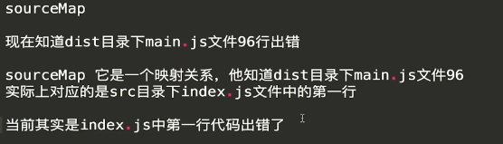 

查看源代码错误位置，而不是打包后的代码出错位置。

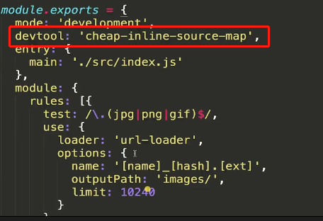 

#### source-map

在打包目录下生成.map文件，用来映射源代码。

**映射到哪一行那一列出错**

#### inline-source-map

删除.map文件将里面的数据转成base64数据放在输出文件的最下面。

#### cheap-source-map

cheap代表映射到哪一行，不会精确到哪一列，提升打包速度

#### cheap-module-source-map

module代表会映射到出错的loader或者plugin上

#### eval

用eval的方式提示错误

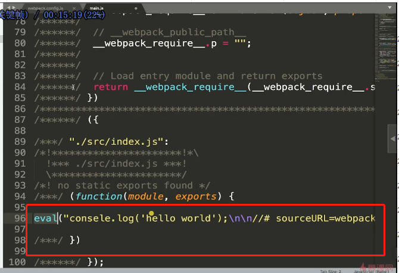 

**注意：**在开发环境中建议使用cheap-module-eval-source-map

​	在生产中使用cheap-module-source-map


## 持续开发

### 第一种

```json
script:{
	"watch":"webpack --watch"
}
```

### 第二种：WebpackDevServer

#### devServer

>contentBase  启动的根目录
>
>open        是否自动打开浏览器
>
>proxy        接口代理
>
>port       端口

```json
script:{
	"start":"webpack-dev-server"
}
```

### 第三种：自己写一个server

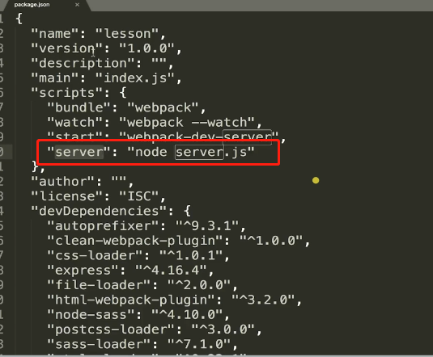 

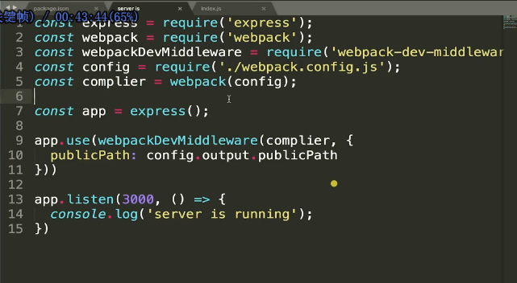 

## hmr

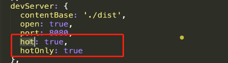 

>hot  
>
>hotOnly  即便hmr不生效也不让浏览器自动刷新

需要加载一个插件

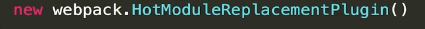 

###  开启热更新模式

热更新，这个在样式改变的时候不会刷新页面，只会更新样式，如果这个不开启，每次样式更改就会刷新页面。

#### 对于js代码需要书写代码来实现热更新

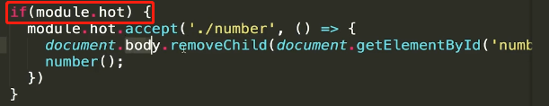 

## babel

```shell
npm install --save-dev babel-loader @babel/core
```

```js
{
  module: {
    rules: [
      {
        test: /\.m?js$/,
        exclude: /node_modules/,
        use: {
          loader: "babel-loader",
          options: {
            presets: ['@babel/preset-env']
          }
        }
      }
    ]
  }
}
```

babel-loader是babel和webpack的通信桥梁，并不能转化为es5语法

####  babel.config.json

```shell
npm install @babel/preset-env --save-dev
```

```js
{
  "presets": ["@babel/preset-env"]
}
```

@babel/preset-env用来做语法翻译，但是新特性低版本的浏览器还是不支持的

```shell
npm install --save @babel/polyfill
```

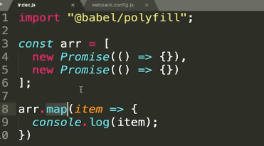 

以上将新的特性都加到了main.js中，导致很大。

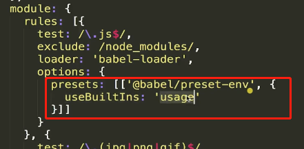 

只添加已使用的新特性polyfill,减少代码体积

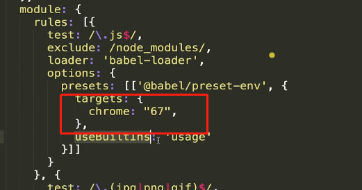 

指定适配浏览器版本，减少代码体积

### plugin-transform-runtime

> plugin-transform-runtime用于组件库的书写
>
> polyfill用于普通开发

全局引入polyfill会污染环境，而引入plugin-transform-runtime，会以闭包的形势引入

```shell
npm install --save-dev @babel/plugin-transform-runtime
```

```js
{
  "plugins": [
    [
      "@babel/plugin-transform-runtime",
      {
        "absoluteRuntime": false,
        "corejs": false,
        "helpers": true,
        "regenerator": true,
        "version": "7.0.0-beta.0"
      }
    ]
  ]
}
```

### `corejs`

一般设置为2.

corejs: 2 仅支持全局变量（例如 Promise）和静态属性（例如 Array.from），而corejs: 3 还支持实例属性（例如 [].includes）。

| `corejs` option | Install command                             |
| --------------- | ------------------------------------------- |
| `false`         | `npm install --save @babel/runtime`         |
| `2`             | `npm install --save @babel/runtime-corejs2` |
| `3`             | `npm install --save @babel/runtime-corejs3` |

## 配置react打包

```shell
npm install --save-dev @babel/preset-react
```

**babel执行顺序从下往上，从右往左**，所以，解析react的先放下面

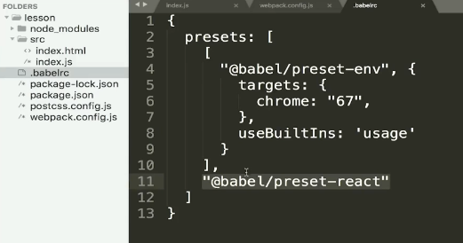 

