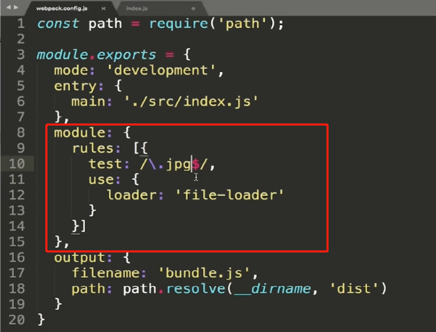
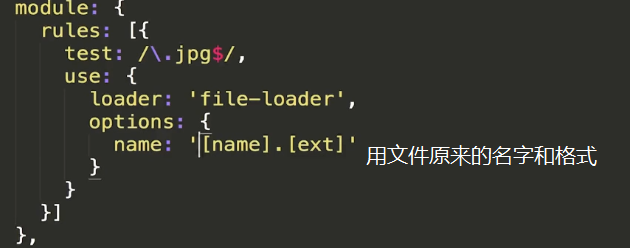
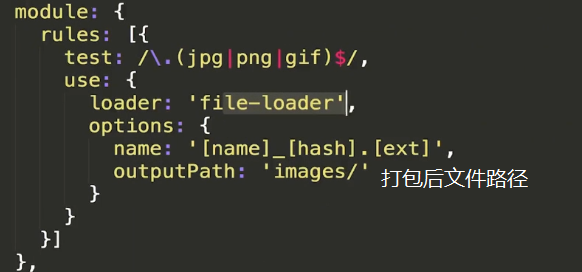
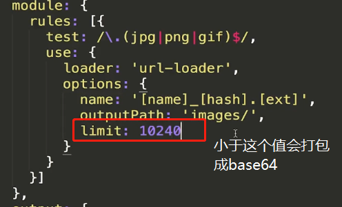
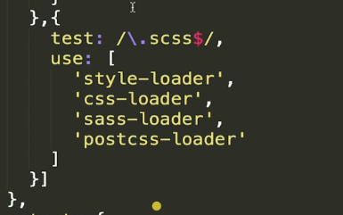
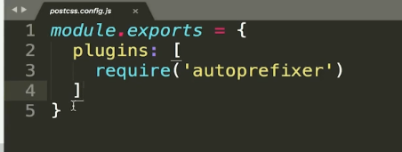

## Loader

是一个打包方案。

 

对于jpg文件需要loader来打包。

### 图片

### file-loader

 

他的参数必须用引号括起来

 

name表示文件名格式**name表示原文件名**，hash表示哈希值，ext表示原始文件的后缀

### url-loader

把需要打包的文件生成base64的数据直接放到bundle.js文件中。

 

大于limit这个值会跟file-loader一样把文件移动到指定文件夹并改变文件的名称。

### css文件

### css-loader

处理各个css文件的样式，将他们整合起来。

### style-loader

将整合后的css放在head头部

#### loader的执行顺序，从右到左，从下到上。

### postcss-loader

添加浏览器前缀

根据webpack文档配置

  

