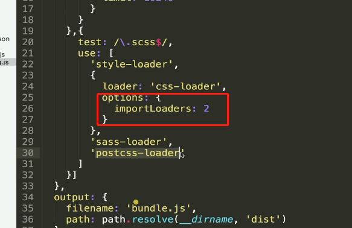
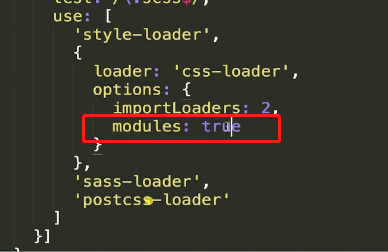
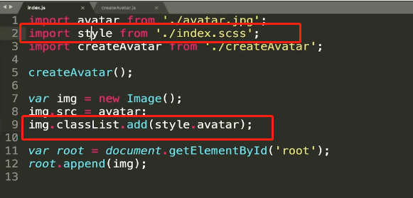
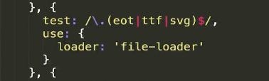
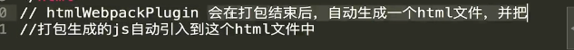
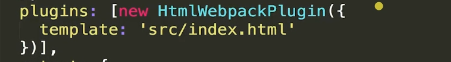
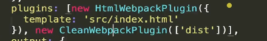
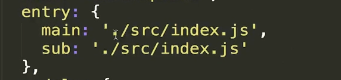
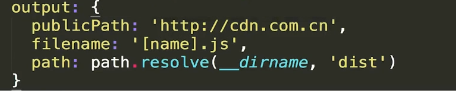
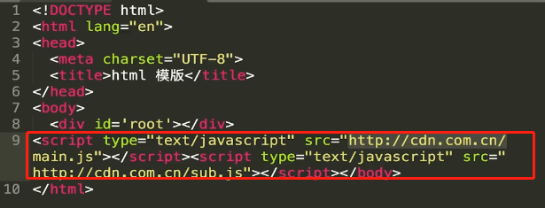

## Loader

> 是一个打包方案。

 

对于jpg文件需要loader来打包。

### 图片

### file-loader

 

他的参数必须用引号括起来

 

name表示文件名格式**name表示原文件名**，hash表示哈希值，ext表示原始文件的后缀

options里面的配置也叫placeholder，就是占位符

### url-loader

把需要打包的文件生成base64的数据直接放到bundle.js文件中。

 

大于limit这个值会跟file-loader一样把文件移动到指定文件夹并改变文件的名称。

### css文件

### css-loader

处理各个css文件的样式，将他们整合起来。

### style-loader

将整合后的css放在head头部

> loader的执行顺序，从右到左，从下到上。

### postcss-loader

添加浏览器前缀

根据webpack文档配置

  

> autoprefixer添加前缀

 

importLoaders的作用，都会依次调用postcss,sass,css,style，以防有些scss文件跳过前俩个loader编译。

### 开启css模块化

避免样式污染

 

 

 

ttl字体文件也需要file-loader来打包

## [Plugin](https://webpack.docschina.org/plugins/)

 

### HtmlWebpackPlugin

 

 

**初始模版设置**

### CleanWebpackPlugin

打包之前运行，清除打包目录以及其下的所有文件。

 

## entry和output

 

 

**entry的多文件属性命名对应output的filename的[name]**

HtmlWebpackPlugin在打包的时候会自动将生成的俩个js引入到index.html文件中。

publicPath为引入的js添加公共前缀

生成文件如下：

 
