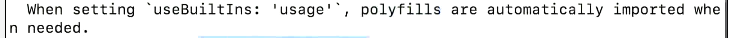
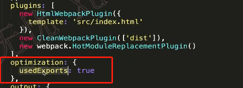
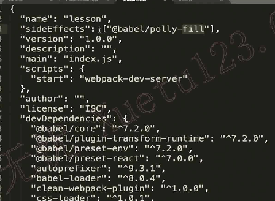
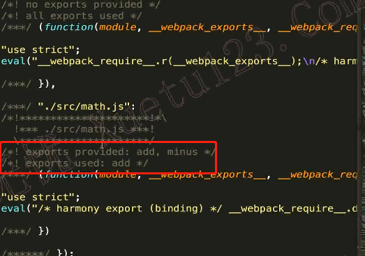

## tree-shaking

> 把模块中没有用到的代码去掉

> 只支持esmodule模块的引入
>
> 因为esmodule是静态引入，require是动态引入

 

#### 开发环境中使用tree-shaking

在plugins下

 

```js
@babel/poll-fill//原理是在window对象上绑定了一些方法,并没有直接导出模块
```

在package.json中设置字段sideEffects可以指定哪些模块不使用tree-shaking

 

> sideEffects:false  //对所有模块进行tree-shaking

特定的文件不使用tree-shaking，例如css文件

> 开发环境中只提示不去除

 

#### 在生产环境下

optimiztion可以不写，package.json中sideEffects:false得写
