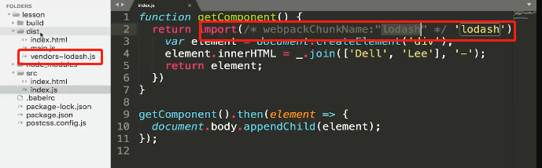

## SplitChunksPlugin配置参数详解

### 魔法注释

 

运用import的懒加载语句以及webpack的魔法注释，在项目进行webpack打包的时候，对不同模块进行代码分割，在首屏加载时，用到哪个模块再加载哪个模块，实现懒加载进行页面的优化。

例子:

在vue的路由中配置

```tsx
const router = new Router({
  routes: [
    {
      path: "/home",
      component: () => import(/* webpackChunkName: "home" */'@/views/home'),
      meta: { type: '首页' }
    }
  ],
});
```

**webpack.config.js**

```js
module.exports = {
  //...
  optimization: {
    splitChunks: {
      chunks: 'async',
      minSize: 20000,
      minRemainingSize: 0,
      minChunks: 1,
      maxAsyncRequests: 30,
      maxInitialRequests: 30,
      enforceSizeThreshold: 50000,
      cacheGroups: {
        defaultVendors: {
          test: /[\\/]node_modules[\\/]/,
          priority: -10,
          reuseExistingChunk: true,
        },
        default: {
          minChunks: 2,
          priority: -20,
          reuseExistingChunk: true,
        },
      },
    },
  },
};
```

> chunks

​	有效值为 `all`，`async` 和 `initial`。async代表异步引入会被代码分割，all是全部。

​	设置为all的时候，同步引入的代码，在没有设置cachegroups时不会做代码分割。

​	webpack代码分割步骤chunks=》cacheGroups

​	打包流程：

​		同步引入lodash库时=》chunks:'all'同步代码也要打包=》cacheGroups.vendors.test检测你引入的库是否在对应正则范围内。Vendors代表的是一个打包的分组。分组是bendors，入口时main。

 

 

> minSize //做代码分割的最小字节，在大于这个数值之后进行代码分割

> defaultVendors是对于node_modules里面的模块代码分割
>
> default是对于其他，引入的模块代码分割

maxSize//分割后文件的最大有多大

minChunks //文件被引用几次后才会进行代码分割

maxAsyncRequests //异步请求同时请求数量