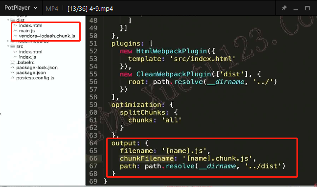
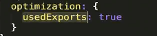
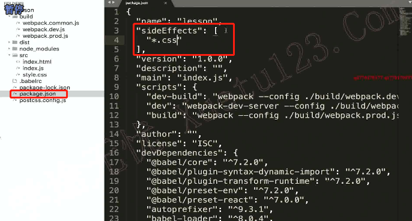
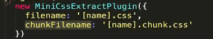

# css文件的代码分割

## chunkFilename和filename

在entry中设置的文件一般由filename命名，其他间接引入的文件由chunkFilename命名



## MiniCssExtractPlugin

在没有插件的情况下，css会被打包到js文件中。

```bash
npm install --save-dev mini-css-extract-plugin
```

这个插件没有生效的情况原因，主要可能是因为使用了tree-shaking的原因，在引入css文件之后没有在文件中使用，所以，tree-shaking会把代码消除。解决办法，设置如下：





表示css文件不做tree-shaking

 

直接引用用filename命名

## optimize-css-assets-webpack-plugin

用于css代码合并压缩

```js
const TerserJSPlugin = require("terser-webpack-plugin");
const MiniCssExtractPlugin = require("mini-css-extract-plugin");
const OptimizeCSSAssetsPlugin = require("optimize-css-assets-webpack-plugin");//css代码压缩
module.exports = {
  optimization: {
    minimizer: [
      new TerserJSPlugin({}),
      new OptimizeCSSAssetsPlugin({})
    ]
  },
  plugins: [
    new MiniCssExtractPlugin({
      filename: "[name].css",
      chunkFilename: "[id].css"
    })
  ],
  module: {
    rules: [
      {
        test: /\.css$/,
        use: [
          MiniCssExtractPlugin.loader,
          "css-loader"
        ]
      }
    ]
  }
}
```

### 多入口文件

#### css打包到一个文件里面

```js
const MiniCssExtractPlugin = require("mini-css-extract-plugin");
module.exports = {
  optimization: {
    splitChunks: {
      cacheGroups: {
        styles: {
          name: 'styles',
          test: /\.css$/,
          chunks: 'all',
          enforce: true
        }
      }
    }
  },
  plugins: [
    new MiniCssExtractPlugin({
      filename: "[name].css",
    })
  ],
  module: {
    rules: [
      {
        test: /\.css$/,
        use: [
          MiniCssExtractPlugin.loader,
          "css-loader"
        ]
      }
    ]
  }
}
```

#### 根据入口不同css打包到对应的文件中

```javascript
const path = require('path');
const MiniCssExtractPlugin = require("mini-css-extract-plugin");

function recursiveIssuer(m) {
  if (m.issuer) {
    return recursiveIssuer(m.issuer);
  } else if (m.name) {
    return m.name;
  } else {
    return false;
  }
}

module.exports = {
  entry: {
    foo: path.resolve(__dirname, 'src/foo'),
    bar: path.resolve(__dirname, 'src/bar')
  },
  optimization: {
    splitChunks: {
      cacheGroups: {
        fooStyles: {
          name: 'foo',
          test: (m,c,entry = 'foo') => m.constructor.name === 'CssModule' && recursiveIssuer(m) === entry,
          chunks: 'all',
          enforce: true
        },
        barStyles: {
          name: 'bar',
          test: (m,c,entry = 'bar') => m.constructor.name === 'CssModule' && recursiveIssuer(m) === entry,
          chunks: 'all',
          enforce: true
        }
      }
    }
  },
  plugins: [
    new MiniCssExtractPlugin({
      filename: "[name].css",
    })
  ],
  module: {
    rules: [
      {
        test: /\.css$/,
        use: [
          MiniCssExtractPlugin.loader,
          "css-loader"
        ]
      }
    ]
  }
}
```

