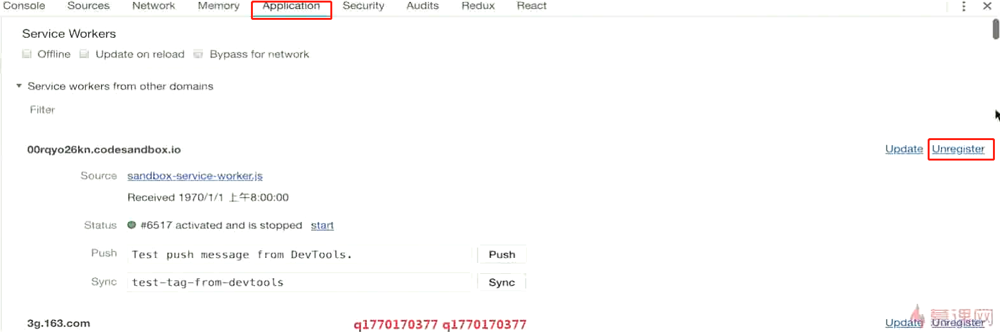
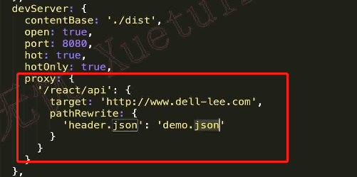
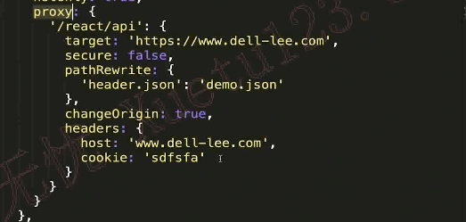

# webpackDevServer实现请求转发



去除servicve Workers对项目的影响，取消注册

### devServer

 

**开发环境下才会生效**

**webpack.config.js**

```javascript
module.exports = {
  //...
  devServer: {
    proxy: {
      '/api': 'http://localhost:3000'
    }
  }
};
```

请求到 `/api/users` 现在会被代理到请求 `http://localhost:3000/api/users`。

如果你不想始终传递 `/api` ，则需要重写路径：

**webpack.config.js**

```javascript
module.exports = {
  //...
  devServer: {
    proxy: {
      '/api': {
        target: 'http://localhost:3000',
        pathRewrite: {'^/api' : ''}
      }
    }
  }
};
```

默认情况下，不接受运行在 HTTPS 上，且使用了无效证书的后端服务器。如果你想要接受，修改配置如下：

**webpack.config.js**

```javascript
module.exports = {
  //...
  devServer: {
    proxy: {
      '/api': {
        target: 'https://other-server.example.com',
        secure: false
      }
    }
  }
};
```

有时你不想代理所有的请求。可以基于一个函数的返回值绕过代理。

在函数中你可以访问请求体、响应体和代理选项。必须返回 `false` 或路径，来跳过代理请求。

例如：对于浏览器请求，你想要提供一个 HTML 页面，但是对于 API 请求则保持代理。你可以这样做：

**webpack.config.js**

```javascript
module.exports = {
  //...
  devServer: {
    proxy: {
      '/api': {
        target: 'http://localhost:3000',
        bypass: function(req, res, proxyOptions) {
          if (req.headers.accept.indexOf('html') !== -1) {
            console.log('Skipping proxy for browser request.');
            return '/index.html';
          }
        }
      }
    }
  }
};
```

如果你想要代理多个路径特定到同一个 target 下，你可以使用由一个或多个「具有 `context` 属性的对象」构成的数组：

**webpack.config.js**

```javascript
module.exports = {
  //...
  devServer: {
    proxy: [{
      context: ['/auth', '/api'],
      target: 'http://localhost:3000',
    }]
  }
};
```

注意，默认情况下，根请求不会被代理。要启用根代理，应该将 `devServer.index` 选项指定为 falsy 值：

**webpack.config.js**

```javascript
module.exports = {
  //...
  devServer: {
    index: '', // specify to enable root proxying
    host: '...',
    contentBase: '...',
    proxy: {
      context: () => true,
      target: 'http://localhost:1234'
    }
  }
};
```

默认情况下，代理时会保留主机标头的原点，您可以将changeOrigin设置为true以覆盖此行为。它在某些情况下很有用，例如使用基于名称的虚拟托管站点。

**webpack.config.js**

```javascript
module.exports = {
  //...
  devServer: {
    proxy: {
      '/api': 'http://localhost:3000',
      changeOrigin: true
    }
  }
};
```


 
