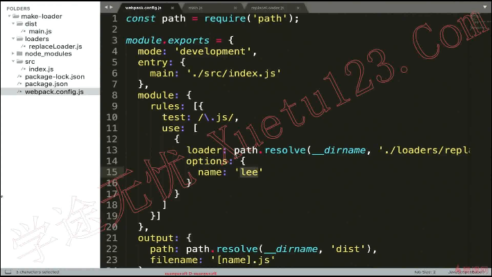
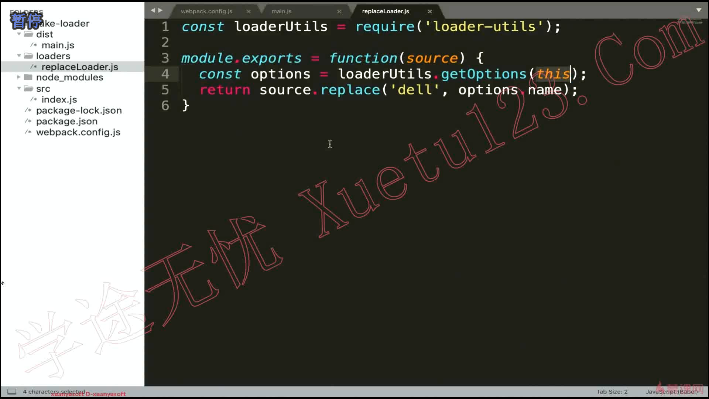
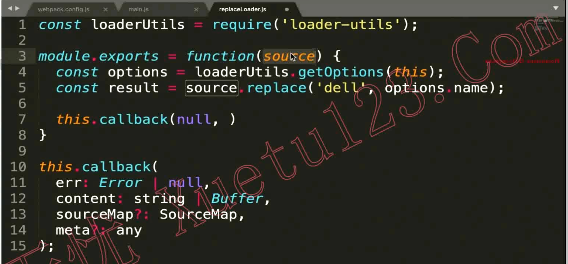
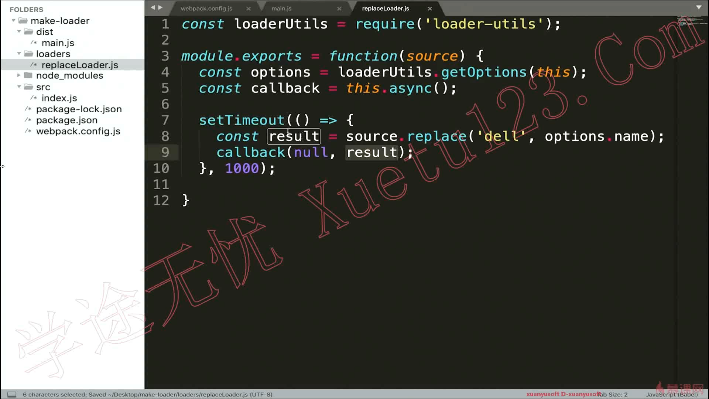
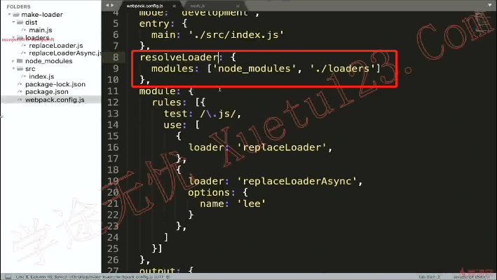

# 如何编写一个loader

**loader就是一个函数，但是不能写成箭头函数。**因为函数内部要使用this，用箭头函数他的this的指向有问题。

参数source//你引入文件的源代码

配置文件中的options参数，会在loader的this.query上

 

 

### `this.query` 

1. 如果这个 loader 配置了 [`options`](https://v4.webpack.docschina.org/configuration/module/#useentry) 对象的话，`this.query` 就指向这个 option 对象。
2. 如果 loader 中没有 `options`，而是以 query 字符串作为参数调用时，`this.query` 就是一个以 `?` 开头的字符串。

> 使用 `loader-utils` 中提供的 [`getOptions` 方法](https://github.com/webpack/loader-utils#getoptions) 来提取给定 loader 的 option。

### `this.callback` 

一个可以同步或者异步调用的可以返回多个结果的函数。预期的参数是：

```javascript
this.callback(
  err: Error | null,
  content: string | Buffer,
  sourceMap?: SourceMap,
  meta?: any
);
```

1. 第一个参数必须是 `Error` 或者 `null`
2. 第二个参数是一个 `string` 或者 [`Buffer`](https://nodejs.org/api/buffer.html)。
3. 可选的：第三个参数必须是一个可以被[这个模块](https://github.com/mozilla/source-map)解析的 source map。
4. 可选的：第四个选项，会被 webpack 忽略，可以是任何东西（例如一些元数据）。

> 可以将抽象语法树(abstract syntax tree - AST)（例如 [`ESTree`](https://github.com/estree/estree)）作为第四个参数（`meta`），如果你想在多个 loader 之间共享通用的 AST，这样做有助于加速编译时间。

如果这个函数被调用的话，应该返回 undefined 从而避免含糊的 loader 结果。

 

## loader中有异步操作

### `this.async` 

告诉 [loader-runner](https://github.com/webpack/loader-runner) 这个 loader 将会异步地回调。返回 `this.callback`。

步骤

1声明有一个异步操作

2返回数据，返回的是this.callback

 

## resolveLoader

指定loader的寻找范围

 
