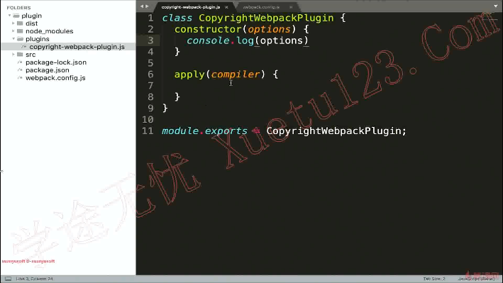
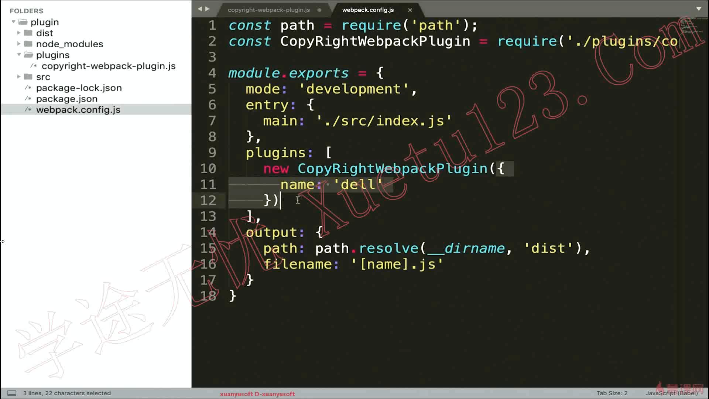
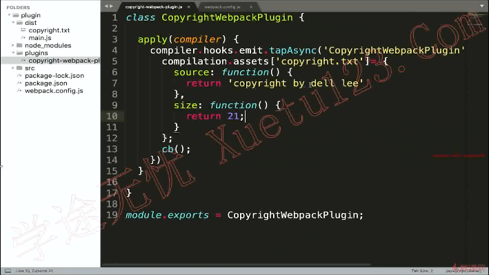
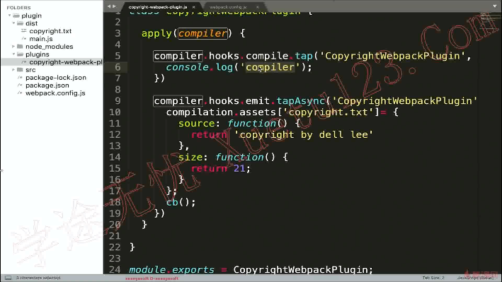
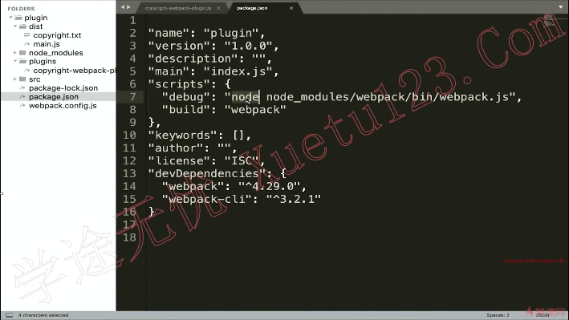
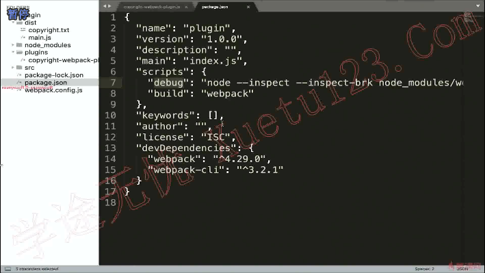
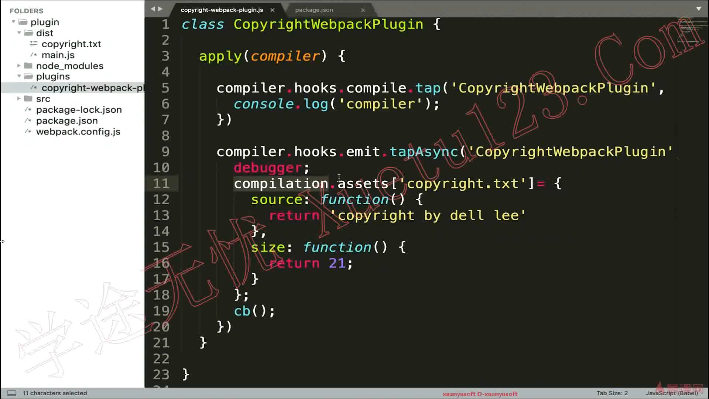
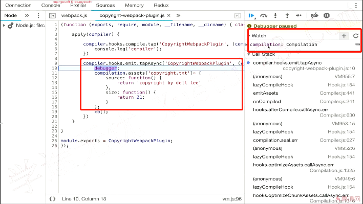

# 如何编写一个plugin

 **插件本质是一个类，使用的时候需要实例化。**

 

 

**compiler是webpack的实例**

 

 

异步时刻和同步时刻不同之处：

​	1参数都有compilation hook，同步没有callback

​	2异步在最后需要执行callback

​	3钩子函数声明不同同步为tap，异步为tapAsync

 

添加node的debug模式

 

 

