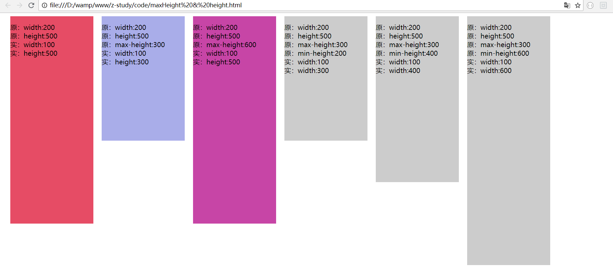

MDN说法：

`max-height` 这个属性会阻止 [`height`](https://developer.mozilla.org/zh-CN/docs/Web/CSS/height) 属性的设置值变得比 `max-height` 更大。

`max-height `属性用来设置给定元素的最大高度. 如果`height` 属性设置的高度比该属性设置的高度还大,则`height` 属性会失效.

[`max-height`](https://developer.mozilla.org/zh-CN/docs/Web/CSS/max-height) 重载（覆盖掉） [`height`](https://developer.mozilla.org/zh-CN/docs/Web/CSS/height), 但是 [`min-height`](https://developer.mozilla.org/zh-CN/docs/Web/CSS/min-height) 又会重载（覆盖掉） [`max-height`](https://developer.mozilla.org/zh-CN/docs/Web/CSS/max-height).

实际效果：

 　当 height 和 max-height一起使用时，谁小听谁的

   　　max-height <  height   元素高度：  max-height

　  　height < max-height   元素高度：  height

　　当 height,max-height,min-height一起使用时

　　height > max-height > min-height     元素高度：max-height

　　height > min-height > manx-height    元素高度：min-height

　　min-height > height > max-height      元素高度：min-height

