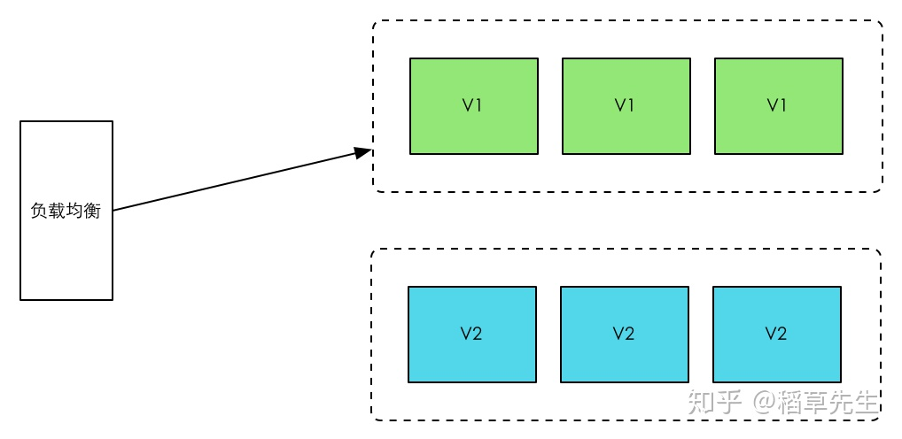
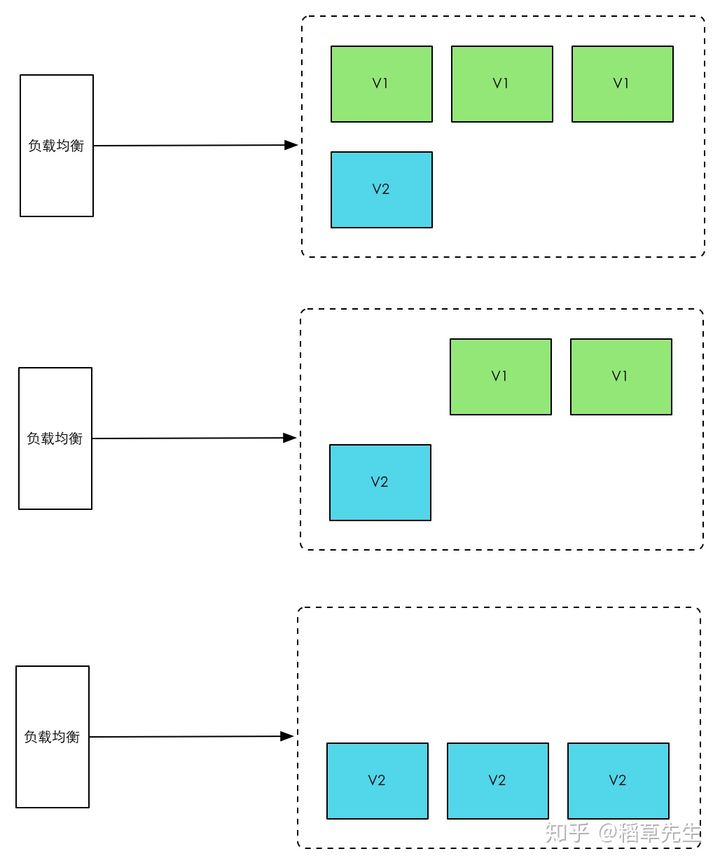
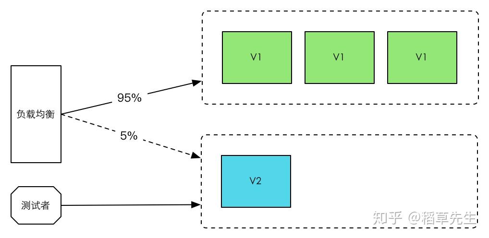

## **蓝绿部署**Blue/Green Deployment

所谓蓝绿部署，是指同时运行两个版本的应用，如上图所示，蓝绿部署的时候，并不停止掉老版本，而是直接部署一套新版本，等新版本运行起来后，再将流量切换到新版本上。但是蓝绿部署要求在升级过程中，同时运行两套程序，对硬件的要求就是日常所需的二倍

## **滚动发布**Rolling update

所谓滚动升级，就是在升级过程中，并不一下子启动所有新版本，是先启动一台新版本，再停止一台老版本，然后再启动一台新版本，再停止一台老版本，直到升级完成，这样的话，如果日常需要10台服务器，那么升级过程中也就只需要11台就行了。

但是滚动升级有一个问题，在开始滚动升级后，流量会直接流向已经启动起来的新版本，但是这个时候，新版本是不一定可用的，比如需要进一步的测试才能确认。那么在滚动升级期间，整个系统就处于非常不稳定的状态，如果发现了问题，也比较难以确定是新版本还是老版本造成的问题。

为了解决这个问题，我们需要为滚动升级实现流量控制能力。

## **灰度发布**

灰度发布也叫金丝雀发布，起源是，矿井工人发现，金丝雀对瓦斯气体很敏感，矿工会在下井之前，先放一只金丝雀到井中，如果金丝雀不叫了，就代表瓦斯浓度高。

在灰度发布开始后，先启动一个新版本应用，但是并不直接将流量切过来，而是测试人员对新版本进行线上测试，启动的这个新版本应用，就是我们的金丝雀。如果没有问题，那么可以将少量的用户流量导入到新版本上，然后再对新版本做运行状态观察，收集各种运行时数据，如果此时对新旧版本做各种数据对比，就是所谓的A/B测试。

当确认新版本运行良好后，再逐步将更多的流量导入到新版本上，在此期间，还可以不断地调整新旧两个版本的运行的服务器副本数量，以使得新版本能够承受越来越大的流量压力。直到将100%的流量都切换到新版本上，最后关闭剩下的老版本服务，完成灰度发布。

如果在灰度发布过程中（灰度期）发现了新版本有问题，就应该立即将流量切回老版本上，这样，就会将负面影响控制在最小范围内。