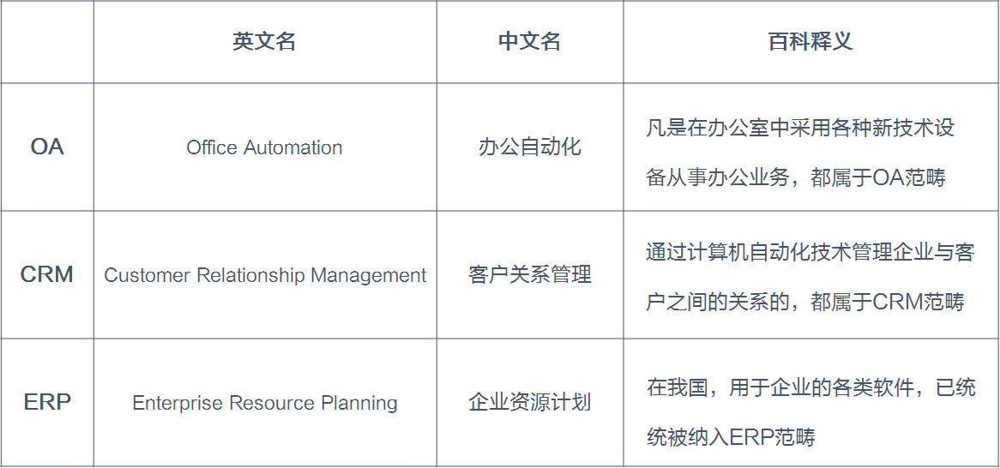

- CRM多是管**外部客户**的，比如客户成单了没？销售今天去拜访客户了没？
- OA多是管**内部人员**的，比如考勤数据怎么样？申请请假怎么操作？
- ERP多是管**内部物资**的，比如这个月工厂货物有多少出库、多少入库？

# [一秒钟看懂SaaS、CRM、OA、ERP、HR、进销存](https://www.cnblogs.com/tuyile006/p/5776061.html)

**SaaS模式就像用自来水**

　　2015年被媒体和IT从业人员称为SaaS元年。什么是SaaS呢？SaaS是Software-as-a-Service（软件即服务）的简称，“软件即服务”，简单理解也就是“按需租用别人提供的软件服务”，它是一种软件交付模式。SaaS这个说法是区别于以往软件购买和交付方式而提出的。

　　在以往，如果你的公司需要使用一款软件来管理财务记账，作为公司管理者，你需要向软件提供公司说明需求、支付购买软件的费用并提供安装软件的硬件环境，然后软件公司就会上门安装调试软件，调试完后就可以正式投入使用了。

　　这里有一个很显著的特点是，软件都安装在你指定的地方，你拥有100%的管控权，相应的，你后续还需要继续投入人员和资源来维护系统的正常运行。

　　SaaS的模式就不一样了，在客户还没有到来之前，软件提供公司就自己提服务器、数据库等硬件，把软件安装发布好，这样作为软件使用方的你就变得轻松很多，一上来就可以直接进行体验，体验之后，你觉得哪些功能合适你的，就挑选出来，按月支付比较低廉的费用就可以正式使用了。后续的升级、维护也由软件公司负责。简而言之，SaaS模式就是软件提供公司事先把所有的软件相关工作都归类准备好了，用户直接过来挑选自己需要的用就OK了。

　　业内有一个很恰当的比喻：一开始的时候，各家都是自己挖井抽水蓄水，挖井抽水蓄水的技术是有专业的公司提供，但总的来说喝水这个事情是自家管自家的，这是传统软件的供水模式。在SaaS模式下，挖井抽水蓄水净水修水管这些工作对使用方来说都是透明的，你有需要的时候就打开水龙头取水就OK了，然后每月自来水公司会过来跟你结算。同样的，优缺点很明显，优点是按需用水省事了，成本变低了，缺点是水由水务公司完全控制，供水稳定性、供水质量取决于水务公司实力。

　　**CRM是什么呢？追踪客户的**

　　CRM是英文Customer Relationship Management （客户关系管理）的简称。这个比较好理解，就是用来管理客户的。

　　一般来说，CRM客户管理系统由客户信息管理、销售过程自动化（SFA）、营销自动化（MA）、客户服务与支持（CSS）管理、客户分析（CA）系统这5大主要功能模块组成。

　　通俗一点说，CRM系统特别是移动CRM系统能帮助你及你的同事很方便地记录客户信息、跟踪分析新老客户、挖掘潜在客户。

　　**OA是什么呢？管办公室活动的**

　　OA是Office Automation（办公自动化）的简称，本来OA涵盖的范围非常广泛，基本上所有和办公相关的系统都可以称作是OA，但现在大都数公司都把OA系统定义为企业内部的协作沟通系统，一般提供的功能有流程审批（请假报销等）、即时沟通、文档管理、内部论坛、任务管理、会议管理、通讯录、问卷调查等。

　　***\**\*\*\*ERP\*\*\*\*是什么呢？生产制造一条龙全包\*\*\*\*\****

　　ERP是Enterprise Resource Planning（企业资源计划）的简称，从字面上理解，各企业的资源、计划相关的管理都可以算在ERP的范畴里，比如员工、生产、制造、财务、销售、采购、仓储、分销、质量等等，只要是用于企业管理的软件都属于ERP的范畴。由于越来越多的细分系统的出现，行业内人们为了做区分，一般把功能比较全面（往往包含从原料到生产到仓储到销售一系列）的偏生产制造的管理系统才定义为ERP系统，而其中某项细分功能的系统虽然原则上属于ERP，但一般不称为ERP。

　　**HR****软件是什么？管员工的**

　　HR软件是human resource software（人力资源软件）的简称，就是用来管理人事相关的系统，比如招聘管理、职工管理、劳动合同、奖惩管理、办公用品、培训管理、绩效管理、考勤管理、社保管理等。

　　**什么是进销存？**

　　进销存是指企业管理过程中采购（进货）→入库（库存）→销售（销货）的三个管理过程。这三个过程是一般企业特别是中小商户的核心经营过程，用来管理这三个过程的系统就是进销存系统，简称进销存。

　　**什么是财务系统？**

　　财务系统是指专门用于完成会计工作的管理系统。财务系统一般包含：总账管理、固定资产管理、资金管理、客户及应收应付管理、报表管理、财务分析、核算系统等。

　　***\**\*\*\*SaaS\*\*\*\*、CRM\*\*\*\*、OA\*\*\*\*、ERP\*\*\*\*、HR\*\*\*\*、进销存、财务系统的区别在哪里？\*\*\*\*\****

　　SaaS是一种软件交付（交易）模式，以这种“按需租用”模式提供服务的软件称为SaaS，目前大部分的软件都采取这种模式，也就是说大部分的OA、ERP、HR、进销存、财务系统都可以叫作SaaS软件。由于ERP系统覆盖的链条很长，一般需要深度定制，所以比较少是以SaaS提供的。

　　现在的CRM、OA、HR、进销存、财务系统一般都以SaaS方式提供，CRM更专注于销售方面的管理，OA更专注于企业内部的协作沟通，HR更专注于人力管理，进销存专注于仓库相关的管理、财务系统专注资产、预算相关的管理。

　　由于它们涉及到企业不同时间段、不同角色、不同业务等各个方面，同时也因为各企业的规模、经营方式几乎完全不同，所以目前没有哪一款产品能囊括CRM、OA、HR、进销存等这些功能，目前市面上的产品能还处于在自己专注的领域深耕发展的阶段。

　　当然为了更快地拉开同竞争对手的差距，它们往往选择开放相互对接的方式，比较钉钉这些OA系统就提供了开放平台，用于对接进销存、财务系统。

　　***\**\*\*\*CRM\*\*\*\*、OA\*\*\*\*、ERP\*\*\*\*、HR\*\*\*\*、进销存、财务系统目前有哪些代表产品？\*\*\*\*\****

　　CRM的标杆是美国的Salesforce，国内有纷享逍客、销售易、红圈营销、八百客等。

　　OA在国内有钉钉、云之家、今目标、微信企业号、企业微信（即将上线）这几个产品，有很多稍微大一点的企业内部会自建OA系统，等内部使用实施成熟后也会开放出来供外部使用。

　　ERP和财务系统，素来有“南金蝶北用友”之称，这两家拿下中国大部分市场份额，SAP则是全球最成功是ERP厂商，据称85%的世界500强公司都有使用SAP系统，但这套系统非常昂贵非常复杂，不适用于中小企业。

　　HR。有北森、dayHR、金柚等，由于单纯的HR系统很容易被OA或进销存击穿，现在的HR往往做得非常深，人才评测、招聘等都会涉及。

　　进销存系统，有管家婆、智慧记、云销城、秦丝生意通等，在采购、销售、库存这三个最核心的管理环节需求会非常强烈，但对于操作速度要求很高，一般软件很难满足，所以目前来说进销存的普及率还不到8%。

　　***\*2016\**\**年CRM\**\**、OA\**\**、ERP\**\**、HR\**\**、进销存、财务系统的趋势是怎么样的？\****

　　1、SaaS化。对于提供方而言标准化的SaaS产品更具有爆发性，对于消费方而言SaaS具有低成本、随时随地接入访问这些特性，再加上IT基础设施、安全技术等方面的成熟，SaaS将成为以后最主要的软件模式。

　　2、移动化。金蝶创始人徐少春在发布云之家的时候，把笔记本直接扔进垃圾桶了，说以后只使用手机办公，这虽然是一个噱头，但确实说明移动办公是个大趋势。

　　3、垂直化。前面说过，不同规模、不同阶段、不同行业的企业对企业应用的需求千差万别，企业内部中不同岗位、不同时段、不同职别的员工对企业应用的需求同样也千差万别，往往需要垂直细分到具体的行业才有可能做精，做更好的体验。

　　4、免费化。SaaS化、竞争白热化、周边资源可整合、软件边际成本趋零等这些原因会使得免费的企业级应用会越来越多。

　　5、合纵连横化。条件成熟，创业公司有机会崛起，BAT头巨头大举进入，在这个巨大的看似类似却又碎片化的领域，接下来我们会看到一场场合纵连横的好戏会不断上演。

　　6、更普及。以前信息化系统成本很高，往往只有大企业才有能力使用，现在条件成熟，投资机构热钱及创业者的热情投入，企业级应用空前繁荣，企业无论大小都能选择一款适合自己的应用。

　　**涨姿势：几个概念**

　　企业级应用。是指为商业组织、企业服务的应用系统，业内一般称为To B类应用，用于区别对个人类的应用（To C）。

　　APM是Application Performance Management & Monitoring（应用性能管理 & 监控）的简称，是用来监控和管理应用软件是否有效运行的，为上面据说的系统提供相关的监控。

　　EIP 是Enterprise Information Portal（企业信息门户）的简称，当一公司把前面所提到的OA、进销存、财务等等系统都使用上之后，使用人员需要在各个系统之间来回切换，非常麻烦低效，于是EIP就出现了，它就是把各种应用系统统一集成到一个入口系统中，在一平台时管理各个业务。

　　客服系统可以说是CRM系统的延伸，主要提供在线客服聊天、机器人客服、帮助文档、客户反馈等功能。