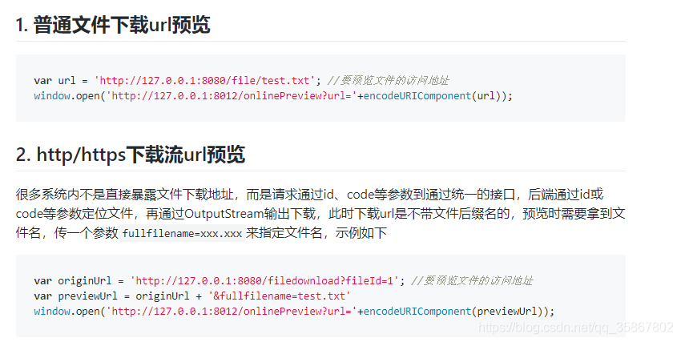

word、ppt、xls文件实现在线预览的方式比较简单可以直接通过调用微软的在线预览功能实现 (预览前提：资源必须是公共可访问的)

```
<iframe
src='https://view.officeapps.live.com/op/view.aspxsrc=http://storage.xuetangx.com/public_assets/xuetangx/PDF/1.xls' width='100%' height='100%' frameborder='1'>
</iframe>
```

使用方式：**https://view.officeapps.live.com/op/view.aspx?src=文档地址**
ps：适用pc端预览，这种方式在移动端不会自动适配，移动端会显示的很怪异。

```
<iframe
    :src="'//ow365.cn/?i=18679&ssl=1&furl='+fileUrl"
    width="100%"
    height="100%"
    frameborder="0">
</iframe>
```

使用方式：**//ow365.cn/?i=18679&ssl=1&furl=文档地址**
ps：适用PC，移动端使用，但是有水印，但是不影响使用

```
<iframe
    :src="'//www.xdocin.com/xdoc?_func=to&_format=html&_cache=1&_xdoc='+fileUrl"
    width="100%"
    height="100%"
    frameborder="">
</iframe>
```

使用方式：**//www.xdocin.com/xdoc?_func=to&_format=html&_cache=1&_xdoc=文档地址**
ps：适用PC，移动端使用，不能处理比较老的word文件，比如.doc后缀的文件，但是显示很清晰，可惜会有个很大的微信二维码，暂时没想到办法怎么去掉，

## word预览下载

word的下载依然使用了A标签直接下载
预览的话，A标签是不支持的，所以找了一个插件kkFileView，简直好用！！！
提供一下他们家的地址~~
官网：https://kkfileview.keking.cn/zh-cn/index.html
码云：https://gitee.com/kekingcn/file-online-preview
github：https://github.com/kekingcn/kkFileView
dockerhub：https://hub.docker.com/r/keking/kkfileview

这个是需要运维童鞋帮忙配置部署环境的



## vue-pdf

```
npm install vue-pdf

yarn add vue-pdf
```

[vue-pdf](https://github.com/FranckFreiburger/vue-pdf)

[vue 使用 vue-pdf 实现pdf在线预览](https://juejin.cn/post/6844904137155411975)

