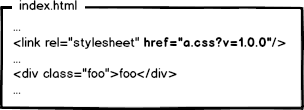

# [大公司是怎么发布静态资源的](https://segmentfault.com/a/1190000007122250)

> 静态资源（Static Resources）: js、css、img 等非服务器动态运行生成的文件。

## 发布要求

### 1. 静态资源必须走 CDN

如非自建 CDN，推荐 又拍云，阿里云，七牛云。

### 2. 平滑升级--非覆盖式发布

> 在不修改线上静态资源的情况下，发布新的静态资源。即 CDN 上的静态资源必须**共存多个静态资源版本**。

 [部署的方案](https://link.segmentfault.com/?url=https%3A%2F%2Fwww.zhihu.com%2Fquestion%2F20790576%2Fanswer%2F32602154)

1. 先部署页面，再部署资源：

   在二者部署的时间间隔内，如果有用户访问页面，就会在新的页面结构中加载旧的资源，并且把这个旧版本的资源当做新版本缓存起来，其结果就是：用户访问到了一个样式错乱的页面，除非手动刷新，否则在资源缓存过期之前，页面会一直执行错误。

2. 先部署资源，再部署页面：

   在部署时间间隔之内，有旧版本资源本地缓存的用户访问网站，由于请求的页面是旧版本的，资源引用没有改变，浏览器将直接使用本地缓存，这种情况下页面展现正常；但没有本地缓存或者缓存过期的用户访问网站，就会出现旧版本页面加载新版本资源的情况，导致页面执行错误，但当页面完成部署，这部分用户再次访问页面又会恢复正常了。

### 3. 精确的缓存控制——文件版本号

> 更新静态资源，只更新修改的部分。不能修改未更新的资源的引用。

**根据文件的内容算出一个值，如果文件内容不改变，那么这个值就不会改变。**

『精确的缓存控制』的原理————我们会很自然的联想到利用 数据摘要要算法 对文件求摘要信息，摘要信息与文件内容一一对应，就有了一种可以精确到单个文件粒度的缓存控制依据了。

Grunt,gulp 也有对应的插件用来解决这个问题。如果你使用 webpack，那么可以配置下 chunkhash 或者 hash。

## 发布和问题

### 1. 发布流程

1. 功能开发结束后，开发人员把静态资源提交到测试环境 Git 仓库。
2. 测试人员在测试环境通过绑定 host 的方式测试，测试通过后，进入发布阶段，需要静态资源代码提交到产品环境 Git 仓库。（使用测试和产品两个仓库，是为了测试和产品环境完全隔离）
3. 源站（origin.res.company.com）从产品环境 Git 拉取静态资源的代码，并且为静态资源提供访问服务（nginx 等），该域名不提供文件缓存服务，仅仅作为 CDN 的回源地址。所以代码中一定不要写源站的信息。
4. 在 CDN 服务商提供的空间中，将**回源地址**配置为源站（origin.res.company.com）。
5. CDN 服务器会提供一个默认的访问域名，比如 `cdn-1.res.cdn_company.com`, 然后把实际需求访问的静态资源域名 `res.company.com` CNAME 到 `cdn-1.res.cdn_company.com`。
6. 代码发布完毕。用户访问的时候，会访问到最近的 CDN 阶段。CDN 结点去文件中心取文件，如果不存在文件则回源到源站，获取文件。(有些 CDN 产品提供文件存储功能，异地备份)
7. 通过这样的流程，就能让用户访通过 CDN 访问到我们的实际资源。

### 2. 怎么做到多个项目共存

> 结论：我们会按照目录来划分业务的静态资源。

### 3. 是否同步源站文件到 CDN

> 结论：同步源站文件到 CDN 能确保实现非覆盖式发布。

## 推荐工具

1. [超厉害的 CDN 服务商——又拍云](https://link.segmentfault.com/?url=https%3A%2F%2Fwww.upyun.com%2Findex.html)
2. [微信出品的前端工程化工具——tmt-workflow](https://link.segmentfault.com/?url=https%3A%2F%2Fgithub.com%2Fweixin%2Ftmt-workflow)
3. [百度团队出品——FIS](https://link.segmentfault.com/?url=https%3A%2F%2Fgithub.com%2Ffex-team%2Ffis)
4. 京东的非官方——JDF
5. [能打造最牛逼的工程化工具——webpack](https://link.segmentfault.com/?url=http%3A%2F%2Fwebpack.github.io%2F)

## 参考文档

1. [大公司里怎样开发和部署前端代码？](https://link.segmentfault.com/?url=https%3A%2F%2Fwww.zhihu.com%2Fquestion%2F20790576)
2. [前端工程精粹（一）：静态资源版本更新与缓存](https://link.segmentfault.com/?url=http%3A%2F%2Fwww.infoq.com%2Fcn%2Farticles%2Ffront-end-engineering-and-performance-optimization-part1)
3. [又拍云【功能介绍】源站资源迁移](https://link.segmentfault.com/?url=https%3A%2F%2Fblog.upyun.com%2F%3Fp%3D252)

[【功能介绍】源站资源迁移](https://blog.upyun.com/?p=252)

# 大公司里怎样开发和部署前端代码？

[大公司里怎样开发和部署前端代码？](https://www.zhihu.com/question/20790576/answer/32602154)

### 你都不让浏览器发资源请求了，这缓存咋更新？

：**通过更新页面中引用的资源路径，让浏览器主动放弃缓存，加载新资源**。好像这样：

#### 另一种情况

 页面引用了3个css，而某次上线只改了其中的a.css，如果所有链接都更新版本，就会导致b.css，c.css的缓存也失效，那岂不是又有浪费了？！

要解决这种问题，必须让url的修改与文件内容关联，也就是说，只有文件内容变化，才会导致相应url的变更，从而实现文件级别的精确缓存控制。

 [数据摘要要算法](https://link.zhihu.com/?target=http%3A//baike.baidu.com/view/10961371.htm) 对文件求摘要信息，摘要信息与文件内容一一对应，就有了一种可以精确到单个文件粒度的缓存控制依据了。

现代互联网企业，为了进一步提升网站性能，会把静态资源和动态网页分集群部署，静态资源会被部署到CDN节点上，网页中引用的资源也会变成对应的部署路径：

当我要更新静态资源的时候，同时也会更新html中的引用吧，就好像这样：

**先部署页面，再部署资源**：在二者部署的时间间隔内，如果有用户访问页面，就会在新的页面结构中加载旧的资源，并且把这个旧版本的资源当做新版本缓存起来，其结果就是：用户访问到了一个样式错乱的页面，除非手动刷新，否则在资源缓存过期之前，页面会一直执行错误。

**先部署资源，再部署页面**：在部署时间间隔之内，有旧版本资源本地缓存的用户访问网站，由于请求的页面是旧版本的，资源引用没有改变，浏览器将直接使用本地缓存，这种情况下页面展现正常；但没有本地缓存或者缓存过期的用户访问网站，就会出现旧版本页面加载新版本资源的情况，导致页面执行错误，但当页面完成部署，这部分用户再次访问页面又会恢复正常了。

先部署谁都不成！都会导致部署过程中发生页面错乱的问题。

这个奇葩问题，起源于资源的 **覆盖式发布**，用 待发布资源 覆盖 已发布资源，就有这种问题。解决它也好办，就是实现 **非覆盖式发布**。

用文件的摘要信息来对资源文件进行重命名，把摘要信息放到资源文件发布路径中，这样，内容有修改的资源就变成了一个新的文件发布到线上，不会覆盖已有的资源文件。上线过程中，先全量部署静态资源，再灰度部署页面，整个问题就比较完美的解决了。

大公司的静态资源优化方案，基本上要实现这么几个东西：

1. 配置超长时间的本地缓存                 —— 节省带宽，提高性能
2. 采用内容摘要作为缓存更新依据      —— 精确的缓存控制
3. 静态资源CDN部署                           —— 优化网络请求
4. 更资源发布路径实现非覆盖式发布  —— 平滑升级

静态资源的缓存控制要求在**前端所有静态资源加载的位置都要做这样的处理**。

作者：张云龙
链接：https://www.zhihu.com/question/20790576/answer/32602154
来源：知乎
著作权归作者所有。商业转载请联系作者获得授权，非商业转载请注明出处。