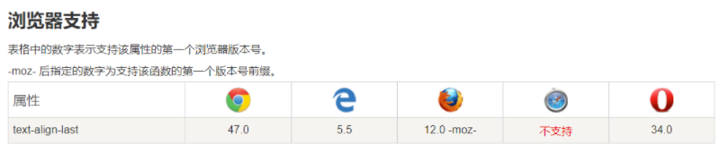

 添加样式：

```
text-align: justify;
text-align-last: justify;
```

最终效果：


```tex
display: block;  
width: 100px;  
text-align: justify;  
text-justify: distribute-all-lines;  
/*ie6-8*/  
text-align-last: justify;  
```



