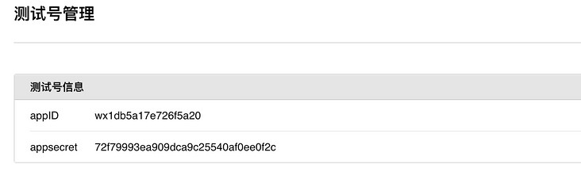
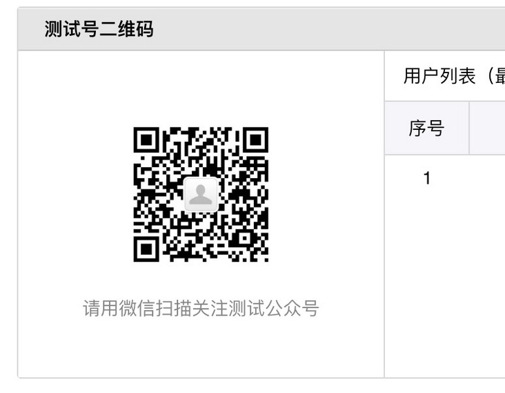
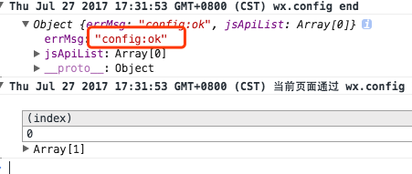

## 分享的调试

#### 1. 下载[微信开发者工具](https://link.segmentfault.com/?url=https%3A%2F%2Fmp.weixin.qq.com%2Fdebug%2Fwxadoc%2Fdev%2Fdevtools%2Fdownload.html)

#### 2. 微信公众平台接口测试帐号申请

[申请账号](https://link.segmentfault.com/?url=http%3A%2F%2Fmp.weixin.qq.com%2Fdebug%2Fcgi-bin%2Fsandbox%3Ft%3Dsandbox%2Flogin)

进入如下页面：

#### 3. 在第2步中的页面中会看到类似的测试号二维码，关注即可

#### 4. 获取access token

[获取access token](https://link.segmentfault.com/?url=https%3A%2F%2Fapi.weixin.qq.com%2Fcgi-bin%2Ftoken%3Fgrant_type%3Dclient_credential%26amp%3Bappid%3DAPPID%26amp%3Bsecret%3DAPPSECRET)

将打开的链接地址上的APPID和APPSECRET替换成对应的第2步中获取的测试账号信息，回车获取access_token

#### 5. 用上一步拿到的access_token 采用http GET方式请求获得jsapi_ticket

[获得jsapi_ticket](https://link.segmentfault.com/?url=https%3A%2F%2Fapi.weixin.qq.com%2Fcgi-bin%2Fticket%2Fgetticket%3Faccess_token%3DACCESS_TOKEN%26amp%3Btype%3Djsapi)

#### 6. 用上一步拿到的jsapi_ticket获得signature

[获得signature](https://link.segmentfault.com/?url=http%3A%2F%2Fmp.weixin.qq.com%2Fdebug%2Fcgi-bin%2Fsandbox%3Ft%3Djsapisign)

#### 7. 在第2步中进入的测试号管理页面设置JS接口安全域名

1. 一级域名，非80端口需要带端口号；
   2: 域名设置不要带http://或者https://，末尾不要带"/"；
   例如：abc.com

#### 8. 查看分享是否成功

以上设置好之后，打开开发者工具，登录后，打开页面，切换到console下面，如果显示如下说明可以愉快的调试分享了:

这块经常会报**invalid url domain**和**invalid signature**，出现前者错误就是第7步没有设置对啦，后者这个错误原因有好多，常犯的错误就是签名生成的不对；

### [微信公众平台接口调试工具](https://mp.weixin.qq.com/debug/)

# [记录一次开发微信网页分享](https://segmentfault.com/a/1190000019091851)

