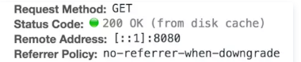

# 微信自带浏览器get请求缓存问题

所有版本上的微信页面返回数据不更新是因为发生`Ajax`缓存。在微信开发者工具上查看发现：

disk cache: 原始资源被存储在本地磁盘上

 

解决方法：在发起Ajax请求时，在请求链接上加时间戳作为参数，以欺骗浏览器，使得每次请求数据的链接都不一样，这样Ajax就不会缓存了，如在请求参数后加上t=1563700885

### 注意：

在同时请求多次相同api时，因为时间戳可能也是一样的。所以得换成随机数。

https://www.jianshu.com/p/6baa49e26533

https://www.jianshu.com/p/7c5a6a42419c
