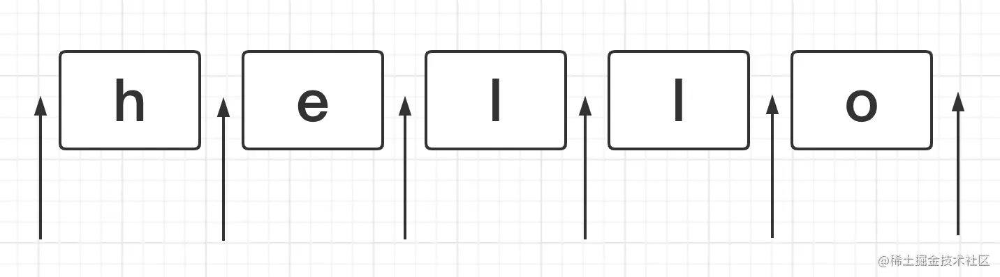
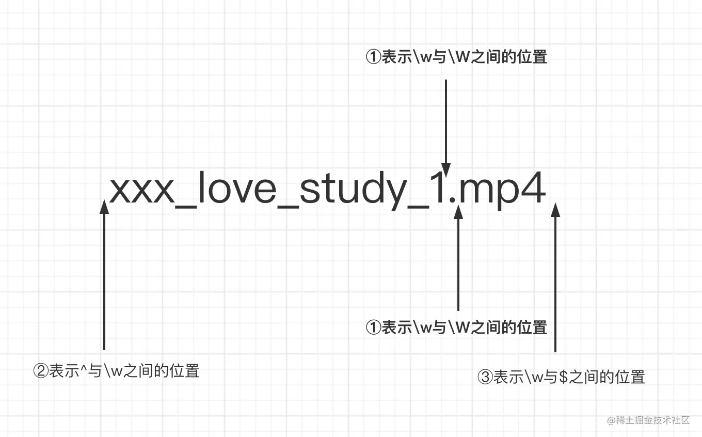
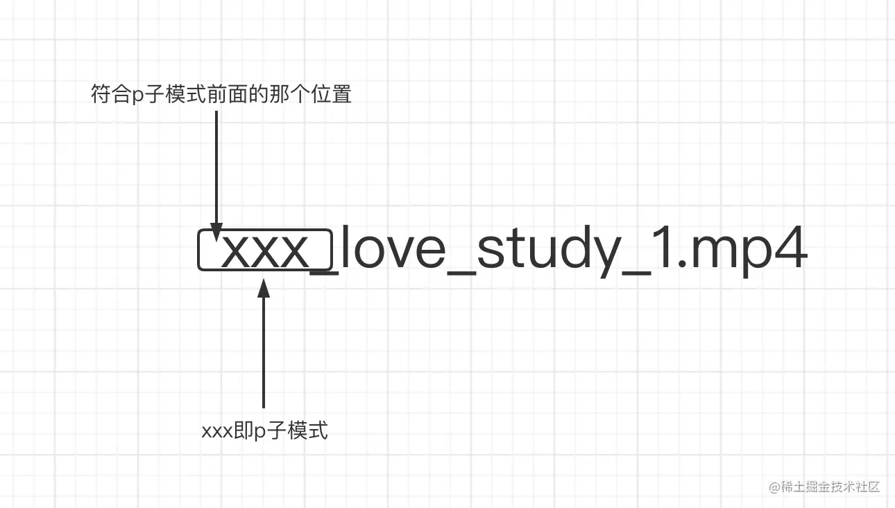

正则表达式是`匹配模式`，要么`匹配字符`，要么`匹配位置`

## 啥是位置？

位置可以理解为**相邻字符之间的位置**。



## 有哪些位置？

正则中常用来表示位置的符号主要有：

^、$、\b、\B、?=p、(?!p)、(?<=p)、(?<!p)

### ^

> 脱字符，匹配行的开头

例如要在hello的开头塞一个笑脸(😄 )怎么搞,这个肯定难不倒你

```javascript
let string = 'hello'

console.log(string.replace(/^/, '😄')) // 😄hello
```

### $

> 美元符号，匹配行的结尾

同理想在hello的结尾塞一个笑脸(😄 )呢？

```javascript
let string = 'hello'

console.log(string.replace(/$/, '😄')) // hello😄
```

### \b

> 单词的边界，具体讲有三点规则。

① \w和\W之间的位置

② ^与\w之间的位置

③ \w与$之间的位置

```js
'xxx_love_study_1.mp4'.replace(/\b/g, '❤️') // ❤️xxx_love_study_1❤️.❤️mp4❤️
```



**\w :匹配包括下划线的任何单词字符,等价于 [A-Z a-z 0-9_]
\W :匹配任何非单词字符,等价于 [^A-Z a-z 0-9_]**

### \B

> 非单词的边界，也就是\b反着来的意思，它的规则如下：

① \w与\w之间的位置

② \W与\W之间的位置

③^与\W之间的位置

④\W与$之间的位置

```js
'[[xxx_love_study_1.mp4]]'.replace(/\B/g, '❤️');
//❤️[❤️[x❤️x❤️x❤️_❤️l❤️o❤️v❤️e❤️_❤️s❤️t❤️u❤️d❤️y❤️_❤️1.m❤️p❤️4]❤️]❤️
```

### (?=p)

> 符合p子模式前面的那个位置。换句话说是，有一个位置，紧跟其后需要满足p子模式。也有一个学名叫正向先行断言。

```js
'xxx_love_study_1.mp4'.replace('xxx', '❤️') // ❤️_love_study_1.mp4
```

利用(?=p)就可以很方便这这件事（可以想想和上面有什么不同？）

```javascript
'xxx_love_study_1.mp4'.replace(/(?=xxx)/g, '❤️') // ❤️xxx_love_study_1.mp4
```



### (?!p)

> (?=p)反过来的意思，可以理解为(?=p)匹配到的位置之外的位置都是属于(?!p)的，它也有一个学名叫负向先行断言。

```js

'xxx_love_study_1.mp4'.replace(/(?!xxx)/g, '❤️') 

// (?=xxx)的输出
❤️xxx_love_study_1.mp4
// (?!xxx)的输出
x❤️x❤️x❤️_❤️l❤️o❤️v❤️e❤️_❤️s❤️t❤️u❤️d❤️y❤️_❤️1❤️.❤️m❤️p❤️4❤️
```

### (?<=p)

> 符合p子模式后面(注意(?=p)表示的是前面)的那个位置。换句话说是，有一个位置，其前面的部分需要满足p子模式。

```js
'xxx_love_study_1.mp4'.replace(/(?<=xxx)/g, '❤️') //xxx❤️_love_study_1.mp4
```

### (?<!p)

> (?<=p)反过来的意思，可以理解为(?<=p)匹配到的位置之外的位置都是属于(?<!p)的，

```js
'xxx_love_study_1.mp4'.replace(/(?<!xxx)/g, '❤️') 

// (?<=xxx)的输出
xxx❤️_love_study_1.mp4
// (?<!xxx)的输出
❤️x❤️x❤️x_❤️l❤️o❤️v❤️e❤️_❤️s❤️t❤️u❤️d❤️y❤️_❤️1❤️.❤️m❤️p❤️4❤️
```

### 题目1：数字的千分位分割法

```js
let price = '123456789'
let priceReg = /(?!^)(?=(\d{3})+$)/g

console.log(price.replace(priceReg, ',')) // 123,456,789
```

### 题目2：手机号3-4-4分割

```js
let mobile = '18379836654'
let mobileReg = /(?=(\d{4})+$)/g

console.log(mobile.replace(mobileReg, '-')) // 183-7983-6654
```

### 题目3：手机号3-4-4分割扩展

> 将手机号11位以内的数字转化为3-4-4格式

```js
const formatMobile = (mobile) => {
  return String(mobile).slice(0,11)
      .replace(/(?<=\d{3})\d+/, ($0) => '-' + $0)
      .replace(/(?<=[\d-]{8})\d{1,4}/, ($0) => '-' + $0)
}

console.log(formatMobile(123)) // 123
console.log(formatMobile(1234)) // 123-4
console.log(formatMobile(12345)) // 123-45
console.log(formatMobile(123456)) // 123-456
console.log(formatMobile(1234567)) // 123-4567
console.log(formatMobile(12345678)) // 123-4567-8
console.log(formatMobile(123456789)) // 123-4567-89
console.log(formatMobile(12345678911)) // 123-4567-8911
```

### 题目4：验证密码的合法性

> 密码长度是6-12位，由数字、小写字符和大写字母组成，但必须至少包括2种字符

题目由三个条件组成

① 密码长度是6-12位

② 由数字、小写字符和大写字母组成

③ 必须至少包括2种字符

**第一步写出条件①和②和正则**

```js
let reg = /^[a-zA-Z\d]{6,12}$/
```

**第二步，必须包含某种字符（数字、小写字母、大写字母）**

```js
let reg = /(?=.*\d)/
// 这个正则的意思是，匹配的是一个位置，这个位置需要满足`任意数量的符号，紧跟着是个数字`，注意它最终得到的是个位置，而不是数字或者是数字前面有任意的东西

console.log(reg.test('hello')) // false
console.log(reg.test('hello1')) // true
console.log(reg.test('hel2lo')) // true
```

**第三步，写出完整的正则**

必须包含两种字符，有下面四种排列组合方式

① 数字和小写字母组合

② 数字和大写字母组合

③ 小写字母与大写字母组合

④ 数字、小写字母、大写字母一起组合（但其实前面三种已经覆盖了第四种了）

```js
// 表示条件①和②
// let reg = /((?=.*\d)((?=.*[a-z])|(?=.*[A-Z])))/
// 表示条件条件③
// let reg = /(?=.*[a-z])(?=.*[A-Z])/
// 表示条件①②③
// let reg = /((?=.*\d)((?=.*[a-z])|(?=.*[A-Z])))|(?=.*[a-z])(?=.*[A-Z])/
// 表示题目所有条件
let reg = /((?=.*\d)((?=.*[a-z])|(?=.*[A-Z])))|(?=.*[a-z])(?=.*[A-Z])^[a-zA-Z\d]{6,12}$/


console.log(reg.test('123456')) // false
console.log(reg.test('aaaaaa')) // false
console.log(reg.test('AAAAAAA')) // false
console.log(reg.test('1a1a1a')) // true
console.log(reg.test('1A1A1A')) // true
console.log(reg.test('aAaAaA')) // true
console.log(reg.test('1aA1aA1aA')) // true
```

## 两种模糊匹配

### 横向

> 一个正则可匹配的字符串的长度不是固定的，可以是多种情况，通过量词+、*、?、{m,n}，可实现横向匹配

```javascript
let reg = /ab{2,5}c/g
let str = 'abc abbc abbbc abbbbc abbbbbc abbbbbbc'

str.match(reg) // [ 'abbc', 'abbbc', 'abbbbc', 'abbbbbc' ]
```

### 纵向

> 一个正则匹配的字符串，具体到某一位字符时，可以不是某个确定的字符串，可以有多种可能，实现方式是字符组( 其实多选分支|也可以实现 )

```javascript
let reg = /a[123]b/g
let str = 'a0b a1b a2b a3b a4b'

str.match(reg) // [ 'a1b', 'a2b', 'a3b' ]
```

## 字符组

> 不要被名字给糊弄了，虽然他叫做字符组，但其实只是代表一个字符的可能性

### 范围表示法

```js
[123456abcdefABCDEF] => [1-6a-fA-F]
```

### 排除字符组

> 某位字符可以是任何东西，但是就是不能是xxx, 使用^符号

问题：如何要表示除了某个单词之外的任意东西呢？

```js
[^abc]
```

### 常见简写形式

```js
\d // 数字
\D // 非数字
\w // [0-9a-zA-Z_]
\W // [^0-9a-zA-Z_]
\s // [\t\v\n\r\f]
\S // [^\t\v\n\r\f]
.
```

## 量词

### 量词 & 简写

```javascript
1. {m,} // 至少出现m次
2. {m} // 出现m次
3. ? // 出现0次或者1次，等价于{0,1}    
4. + // 至少出现1次,等价于{1,} 
5. * // 出现人一次,等价于{0,}  
```

### 贪婪匹配 VS 惰性匹配

> 正则本身是贪婪的，会尽可能的多匹配符合模式的字符

```js
let regex = /\d{2,5}/g
let string = '123 1234 12345 123456'
// 贪婪匹配
// string.match(regex) // [ 123, 1234, 12345, 12345 ]

// 惰性匹配
let regex2 = /\d{2,5}?/g
// string.match(regex) // [ 12, 12, 34, 12, 34, 12, 34, 56  ]
```

量词后面加一个？，即变成了惰性匹配

```javascript
贪婪量词        惰性量词
{m,n}            {m,n}?
{m,}             {m,}?
?                       ??
+                       +?
*                   *?  
```

## 多选分支

一个模式可以实现横向和纵向的模糊匹配，而多选分支可以支持多个子模式任选其一，形式是(p1|p2|p3)

```javascript
let regex = /good|nice/g
let string = 'good idea, nice try.'

// string.match(regex) // [ 'good', 'nice' ]

// 注意，用/good|goodbye/去匹配'goodbye' 匹配到的是good
// 因为分支结构是惰性的，前面的匹配上了，后面的就不再尝试了
```

# 3. 括号的神奇作用

```
括号的作用是提供了分组(括号内的正则是一个整体，即提供子表达式)，便于我们引用它
```

### 分组

如何让量词作用于一个整体？

```javascript
let reg = /(ab)+/g
let string = 'ababa abbb ababab'

console.log(string.match(reg)) // ["abab", "ab", "ababab"]
```

### 分支结构

分支结构有点像编程里面或的概念||

```javascript
/*
匹配 
I love JavaScript
I love Regular Expression
*/

let reg = /I love (JavaScript|Regular Expression)/

console.log(reg.test('I love JavaScript')) // true
console.log(reg.test('I love Regular Expression')) // true
```

## 分组引用

通过括号创建子表达式，可以进行数据提取和强大的替换操作，也可以通过js来引用分组内容

### 提取数据

```javascript
/*
提取年月日
2021-08-14
*/

let reg = /(\d{4})-(\d{2})-(\d{2})/

console.log('2021-08-14'.match(reg))
//  ["2021-08-14", "2021", "08", "14", index: 0, input: "2021-08-14", groups: undefined]

// 第二种解法,通过全局的$1...$9读取 引用的括号数据
let reg = /(\d{4})-(\d{2})-(\d{2})/
let string = '2021-08-14'

reg.test(string)

console.log(RegExp.$1) // 2021
console.log(RegExp.$2) // 08
console.log(RegExp.$3) // 14
```


作者：前端胖头鱼
链接：https://juejin.cn/post/7021672733213720613
来源：稀土掘金
著作权归作者所有。商业转载请联系作者获得授权，非商业转载请注明出处。