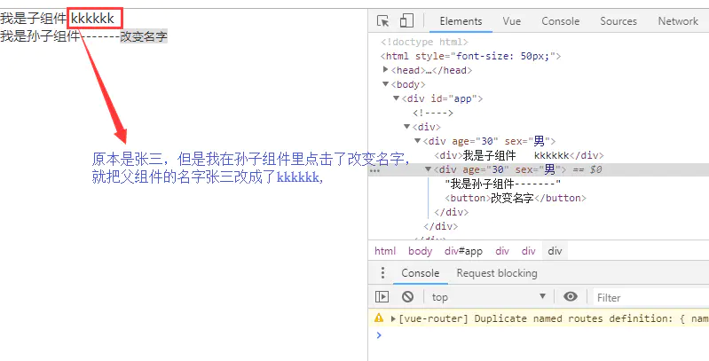

# 彻底弄懂强缓存与协商缓存

[彻底弄懂强缓存与协商缓存](https://www.jianshu.com/p/9c95db596df5)

respone header 的cache-control，常见的设置是max-age public private no-cache no-store等

设置了**cahe-control:max-age=31536000,public,immutable**

max-age表示缓存的时间是31536000秒（1年），

public表示可以被浏览器和代理服务器缓存，代理服务器一般可用nginx来做。

immutable表示该资源永远不变，但是实际上该资源并不是永远不变，它这么设置的意思是为了让用户在刷新页面的时候不要去请求服务器！啥意思？就是说，如果你只设置了cahe-control:max-age=31536000,public  这属于强缓存，每次用户正常打开这个页面，浏览器会判断缓存是否过期，没有过期就从缓存中读取数据；但是有一些 "聪明" 的用户会点击浏览器左上角的刷新按钮去刷新页面，这时候就算资源没有过期（1年没这么快过），浏览器也会直接去请求服务器，这就是额外的请求消耗了，这时候就相当于是走协商缓存的流程了（下面会讲到）。如果cahe-control:max-age=315360000,public再加个immutable的话，就算用户刷新页面，浏览器也不会发起请求去服务，浏览器会直接从本地磁盘或者内存中读取缓存并返回200状态，看上图的红色框（from memory cache）。

这是2015年facebook团队向制定 HTTP 标准的 IETF 工作组提到的建议：他们希望 HTTP 协议能给 Cache-Control 响应头增加一个属性字段表明该资源永不过期，浏览器就没必要再为这些资源发送条件请求了。

#### 强缓存总结

1. cache-control: max-age=xxxx，public
    客户端和代理服务器都可以缓存该资源；
    客户端在xxx秒的有效期内，如果有请求该资源的需求的话就直接读取缓存,statu code:200 ，如果用户做了刷新操作，就向服务器发起http请求
2. cache-control: max-age=xxxx，private
    只让客户端可以缓存该资源；代理服务器不缓存
    客户端在xxx秒内直接读取缓存,statu code:200
3. cache-control: max-age=xxxx，immutable
    客户端在xxx秒的有效期内，如果有请求该资源的需求的话就直接读取缓存,statu code:200 ，即使用户做了刷新操作，也不向服务器发起http请求
4. cache-control: no-cache
    跳过设置强缓存，但是不妨碍设置协商缓存；一般如果你做了强缓存，只有在强缓存失效了才走协商缓存的，设置了no-cache就不会走强缓存了，每次请求都回询问服务端。
5. cache-control: no-store
    不缓存，这个会让客户端、服务器都不缓存，也就没有所谓的强缓存、协商缓存了。

## 二、协商缓存

**为什么要有etag？**
 你可能会觉得使用last-modified已经足以让浏览器知道本地的缓存副本是否足够新，为什么还需要etag呢？HTTP1.1中etag的出现（也就是说，etag是新增的，为了解决之前只有If-Modified的缺点）主要是为了解决几个last-modified比较难解决的问题：

1. 一些文件也许会周期性的更改，但是他的内容并不改变(仅仅改变的修改时间)，这个时候我们并不希望客户端认为这个文件被修改了，而重新get；
2. 某些文件修改非常频繁，比如在秒以下的时间内进行修改，(比方说1s内修改了N次)，if-modified-since能检查到的粒度是秒级的，这种修改无法判断(或者说UNIX记录MTIME只能精确到秒)；

1. 某些服务器不能精确的得到文件的最后修改时间。

## 怎么设置强缓存与协商缓存

nginx配置

index.html文件采用协商缓存，理由就是要用户每次请求index.html不拿浏览器缓存，直接请求服务器，这样就保证资源更新了，用户能马上访问到新资源，如果服务端返回304，这时候再拿浏览器的缓存的index.html，**切记不要设置强缓存！！！**

其他资源采用强缓存 + 协商缓存,理由就不多说了。

**2. 强缓存与协商缓存的区别可以用下表来表示：**

**3. 用户行为对缓存的影响**

即：F5 会 跳过强缓存规则，直接走协商缓存；；；Ctrl+F5 ，跳过所有缓存规则，和第一次请求一样，重新获取资源

**4. 项目缓存策略**

比如 vue 项目，脚手架已经将更改的文件做 hash 处理了，因此一般的 js、css 文件不需要我们再去操作。

而对于 index.html，我们需要在 nginx 上做 no-store 处理，即完全不缓存 index.html，每次都请求最新的html。。。因为 html 中会外链 css、js，如果我 html 还是走的缓存，那链接的还是老的 css 啊，想想？？？

