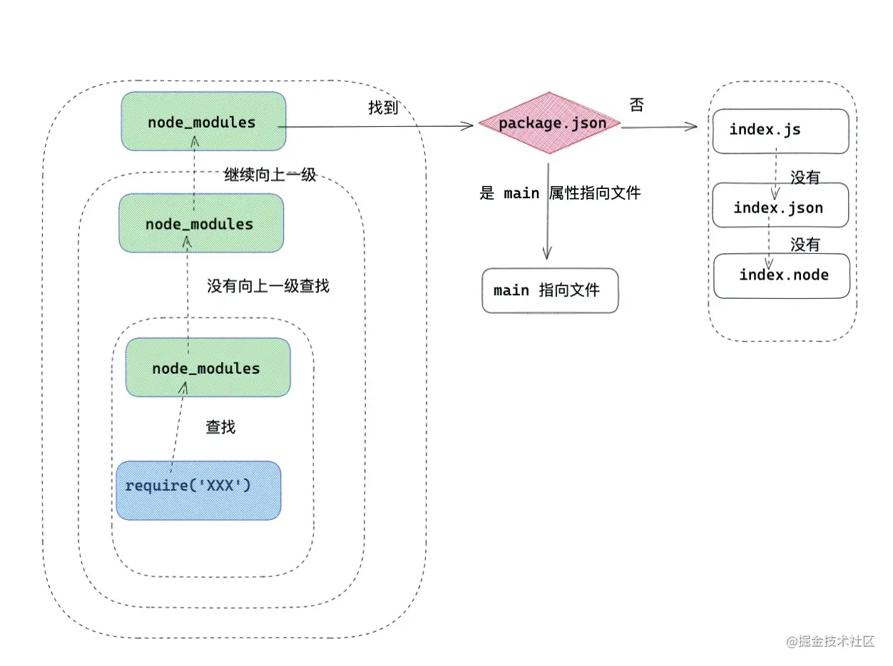

## Commonjs

### 1 commonjs 使用与原理

在使用  规范下，有几个显著的特点。

- 在 `commonjs` 中每一个 js 文件都是一个单独的模块，我们可以称之为 module；
- 该模块中，包含 CommonJS 规范的核心变量: exports、module.exports、require；
- exports 和 module.exports 可以负责对模块中的内容进行导出；
- require 函数可以帮助我们导入其他模块（自定义模块、系统模块、第三方库模块）中的内容；

#### commonjs 实现原理

首先从上述得知每个模块文件上存在 `module`，`exports`，`require`三个变量。在 nodejs 中还存在 `__filename` 和 `__dirname` 变量。

- `module` 记录当前模块信息。
- `require` 引入模块的方法。
- `exports` 当前模块导出的属性

在编译的过程中，实际 Commonjs 对 js 的代码块进行了首尾包装

- 在 Commonjs 规范下模块中，会形成一个包装函数，我们写的代码将作为包装函数的执行上下文，使用的 `require` ，`exports` ，`module` 本质上是通过形参的方式传递到包装函数中的。

```js
function wrapper (script) {
    return '(function (exports, require, module, __filename, __dirname) {' + 
        script +
     '\n})'
}
```

包装函数执行。

```js
const modulefunction = wrapper(`
  const sayName = require('./hello.js')
    module.exports = function say(){
        return {
            name:sayName(),
            author:'我不是外星人'
        }
    }
`)
```

- 如上模拟了一个包装函数功能， script 为我们在 js 模块中写的内容，最后返回的就是如上包装之后的函数。当然这个函数暂且是一个字符串。

```js
 runInThisContext(modulefunction)(module.exports, require, module, __filename, __dirname)
```

- 在模块加载的时候，会通过 runInThisContext (可以理解成 eval ) 执行 `modulefunction` ，传入`require` ，`exports` ，`module` 等参数。最终我们写的 nodejs 文件就这么执行了。

### 2 require 文件加载流程

```js
const fs =      require('fs')      // ①核心模块
const sayName = require('./hello.js')  //② 文件模块
const crypto =  require('crypto-js')   // ③第三方自定义模块
复制代码
```

如上代码片段中：

- ① 为 nodejs 底层的核心模块。
- ② 为我们编写的文件模块，比如上述 `sayName`
- ③ 为我们通过 npm 下载的第三方自定义模块，比如 `crypto-js`。

#### require 加载标识符原则

首先我们看一下 ` nodejs` 中对标识符的处理原则。

- 首先像 fs ，http ，path 等标识符，会被作为 nodejs 的**核心模块**。
- ` ./` 和 `../` 作为相对路径的**文件模块**， `/` 作为绝对路径的**文件模块**。
- 非路径形式也非核心模块的模块，将作为**自定义模块**。

**核心模块的处理：**

核心模块的优先级仅次于缓存加载，在 `Node` 源码编译中，已被编译成二进制代码，所以加载核心模块，加载过程中速度最快。

**路径形式的文件模块处理：**

已 `./` ，`../` 和 `/` 开始的标识符，会被当作文件模块处理。`require()` 方法会将路径转换成真实路径，并以真实路径作为索引，将编译后的结果缓存起来，第二次加载的时候会更快。

**自定义模块处理：** 自定义模块，一般指的是非核心的模块，它可能是一个文件或者一个包，它的查找会遵循以下原则：

- 在当前目录下的 `node_modules` 目录查找。
- 如果没有，在父级目录的 `node_modules` 查找，如果没有在父级目录的父级目录的 `node_modules` 中查找。
- 沿着路径向上递归，直到根目录下的 `node_modules` 目录。
- 在查找过程中，会找 `package.json` 下 main 属性指向的文件，如果没有  `package.json` ，在 node 环境下会以此查找 `index.js` ，`index.json` ，`index.node`。



### 3 require 模块引入与处理

CommonJS 模块同步加载并执行模块文件，CommonJS 模块在执行阶段分析模块依赖，采用**深度优先遍历**（depth-first traversal），执行顺序是父 -> 子 -> 父；

#### require 加载原理

**`module`** ：在 Node 中每一个 js 文件都是一个 module ，module 上保存了 exports 等信息之外，还有一个 **`loaded`** 表示该模块是否被加载。

- 为 `false` 表示还没有加载；
- 为 `true` 表示已经加载

**`Module`** ：以 nodejs 为例，整个系统运行之后，会用 `Module` 缓存每一个模块加载的信息。

require 的源码大致长如下的样子：

```js
 // id 为路径标识符
function require(id) {
   /* 查找  Module 上有没有已经加载的 js  对象*/
   const  cachedModule = Module._cache[id]
   
   /* 如果已经加载了那么直接取走缓存的 exports 对象  */
  if(cachedModule){
    return cachedModule.exports
  }
 
  /* 创建当前模块的 module  */
  const module = { exports: {} ,loaded: false , ...}

  /* 将 module 缓存到  Module 的缓存属性中，路径标识符作为 id */  
  Module._cache[id] = module
  /* 加载文件 */
  runInThisContext(wrapper('module.exports = "123"'))(module.exports, require, module, __filename, __dirname)
  /* 加载完成 *//
  module.loaded = true 
  /* 返回值 */
  return module.exports
}
```

 `require` 大致流程是这样的；

- require 会接收一个参数——文件标识符，然后分析定位文件，分析过程我们上述已经讲到了，加下来会从 Module 上查找有没有缓存，如果有缓存，那么直接返回缓存的内容。
- 如果没有缓存，会创建一个 module 对象，缓存到 Module 上，然后执行文件，加载完文件，将 loaded 属性设置为 true ，然后返回 module.exports 对象。借此完成模块加载流程。
- 模块导出就是 return 这个变量的其实跟 a = b 赋值一样， 基本类型导出的是值， 引用类型导出的是引用地址。
- exports 和 module.exports 持有相同引用，因为最后导出的是 module.exports， 所以对 exports 进行赋值会导致 exports 操作的不再是 module.exports 的引用。

### 4 require 动态加载

require 可以在任意的上下文，动态加载模块。

### 5 exports 和 module.exports

#### exports 使用

**第一种方式：exports** `a.js`

```js
exports.name = `《React进阶实践指南》`
exports.author = `我不是外星人`
exports.say = function (){
    console.log(666)
}
复制代码
```

**引用**

```js
const a = require('./a')
console.log(a)
复制代码
```

**打印结果：**


- exports 就是传入到当前模块内的一个对象，本质上就是 `module.exports`。

**问题：为什么 exports={} 直接赋值一个对象就不可以呢？**

```js
exports={
    name:'《React进阶实践指南》',
    author:'我不是外星人',
    say(){
        console.log(666)
    }
}//{}
```

 exports ， module 和 require 作为形参的方式传入到 js 模块中。我们直接 `exports = {}` 修改 exports ，等于重新赋值了形参，那么会重新赋值一份，但是不会在引用原来的形参。

例子:

```
function wrap (myExports){
    myExports={
       name:'我不是外星人'
   }
}

let myExports = {
    name:'alien'
}
wrap(myExports)
console.log(myExports)//{ name:'alien'}
```

exports 和 module.exports 持有相同引用，因为最后导出的是 module.exports 。那么这就说明在一个文件中，我们最好选择 `exports` 和 `module.exports` 两者之一，如果两者同时存在，很可能会造成覆盖的情况发生。

**既然有了 `exports`，为何又出了 `module.exports `?**

答：如果我们不想在 commonjs 中导出对象，而是只导出一个**类或者一个函数**再或者其他属性的情况，那么 `module.exports` 就更方便了，如上我们知道 `exports` 会被初始化成一个对象，也就是我们只能在对象上绑定属性，但是我们可以通过 `module.exports` 自定义导出出对象外的其他类型元素。

**与 `exports` 相比，`module.exports` 有什么缺陷 ？**

答：`module.exports` 当导出一些函数等非对象属性的时候，也有一些风险，就比如循环引用的情况下。对象会保留相同的内存地址，就算一些属性是后绑定的，也能间接通过异步形式访问到。但是如果 module.exports 为一个非对象其他属性类型，在循环引用的时候，就容易造成属性丢失的情况发生了。


## Es Module

Es Module 的产生有很多优势，比如:

- 借助 `Es Module` 的静态导入导出的优势，实现了 `tree shaking`。
- `Es Module` 还可以 `import()` 懒加载方式实现代码分割。

在 `Es Module` 中用 `export` 用来导出模块，`import` 用来导入模块。

**export 正常导出，import 导入**

export { }， 与变量名绑定，命名导出。

import { } from 'module'， 导入 `module` 的命名导出 ，module 为如上的 `./a.js`

这种情况下 import { } 内部的变量名称，要与 export { } 完全匹配。

**默认导出 export default**

- `export default anything` 导入 module 的默认导出。 `anything` 可以是函数，属性方法，或者对象。
- 对于引入默认导出的模块，`import anyName from 'module'`， anyName 可以是自定义名称。

**混合导入｜导出**

导出模块：`a.js`

```js
export const name = '《React进阶实践指南》'
export const author = '我不是外星人'

export default  function say (){
    console.log('hello , world')
}
```

第一种：

```js
import theSay , { name, author as  bookAuthor } from './a.js'
console.log(
    theSay,     // ƒ say() {console.log('hello , world') }
    name,       // "《React进阶实践指南》"
    bookAuthor  // "我不是外星人"
)
复制代码
```

第二种：

```js
import theSay, * as mes from './a'
console.log(
    theSay, // ƒ say() { console.log('hello , world') }
    mes // { name:'《React进阶实践指南》' , author: "我不是外星人" ，default:  ƒ say() { console.log('hello , world') } }
)
```

- 导出的属性被合并到 `mes` 属性上， `export` 被导入到对应的属性上，`export default` 导出内容被绑定到 `default` 属性上。 `theSay` 也可以作为被 `export default` 导出属性。

**重定向导出**

可以把当前模块作为一个中转站，一方面引入 module 内的属性，然后把属性再给导出去。

```js
export * from 'module' // 第一种方式
export { name, author, ..., say } from 'module' // 第二种方式
export { bookName as name, bookAuthor as author, ..., say } from 'module' //第三种方式
复制代码
```

- 第一种方式：重定向导出 module 中的所有导出属性， 但是不包括 `module` 内的 `default` 属性。
- 第二种方式：从 module 中导入 name ，author ，say 再以相同的属性名，导出。
- 第三种方式：从 module 中导入 name ，重属名为 bookName 导出，从 module 中导入 author ，重属名为 bookAuthor 导出，正常导出 say 。

**无需导入模块，只运行模块**

```js
import 'module' 
复制代码
```

- 执行 module 不导出值  多次调用 `module` 只运行一次。

**动态导入**

```js
const promise = import('module')
复制代码
```

- `import('module') `，动态导入返回一个 `Promise`。为了支持这种方式，需要在 webpack 中做相应的配置处理。

### ES6 module 特性

#### 1 静态语法

ES6 module 的引入和导出是静态的，`import` 会自动提升到代码的顶层 ，`import` , `export` 不能放在块级作用域或条件语句中。

🙅错误写法一：

```js
function say(){
  import name from './a.js'  
  export const author = '我不是外星人'
}
复制代码
```

🙅错误写法二：

```js
isexport &&  export const  name = '《React进阶实践指南》'
复制代码
```

这种静态语法，在编译过程中确定了导入和导出的关系，所以更方便去查找依赖，更方便去 `tree shaking` (摇树) ， 可以使用 lint 工具对模块依赖进行检查，可以对导入导出加上类型信息进行静态的类型检查。

import 的导入名不能为字符串或在判断语句，下面代码是错误的

🙅错误写法三：

```js
import 'defaultExport' from 'module'

let name = 'Export'
import 'default' + name from 'module'
```

#### 2 执行特性

ES6 module 和 Common.js 一样，对于相同的 js 文件，会保存静态属性。

但是与 Common.js 不同的是 ，`CommonJS `模块同步加载并执行模块文件，ES6 模块提前加载并执行模块文件，ES6 模块在预处理阶段分析模块依赖，在执行阶段执行模块，两个阶段都采用深度优先遍历，执行顺序是子 -> 父。

#### 3 导出绑定

**不能修改import导入的属性**

接下来对 import 属性作出总结：

- 使用 import 被导入的模块运行在严格模式下。
- 使用 import 被导入的变量是只读的，可以理解默认为 const 装饰，无法被赋值
- 使用 import 被导入的变量是与原变量绑定/引用的，可以理解为 import 导入的变量无论是否为基本类型都是引用传递。

### import() 动态引入

`import()` 返回一个 `Promise` 对象， 返回的 `Promise` 的 then 成功回调中，可以获取模块的加载成功信息。

`import()`的基本特性。

- `import()` 可以动态使用，加载模块。
- `import()` 返回一个 `Promise` ，成功回调 then 中可以获取模块对应的信息。 `name` 对应 name 属性， `default` 代表 `export default` 。`__esModule` 为 es module 的标识。

#### import() 可以做一些什么

**动态加载**

- 首先 `import()` 动态加载一些内容，可以放在条件语句或者函数执行上下文中。

```js
if(isRequire){
    const result  = import('./b')
}
复制代码
```

**懒加载**

- `import()` 可以实现懒加载，举个例子 vue 中的路由懒加载；

```js
[
   {
        path: 'home',
        name: '首页',
        component: ()=> import('./home') ,
   },
]
复制代码
```

**React中动态加载**

```js
const LazyComponent =  React.lazy(()=>import('./text'))
class index extends React.Component{   
    render(){
        return <React.Suspense fallback={ <div className="icon"><SyncOutlinespin/></div> } >
               <LazyComponent />
           </React.Suspense>
    }
```


作者：我不是外星人
链接：https://juejin.cn/post/6994224541312483336
来源：掘金
著作权归作者所有。商业转载请联系作者获得授权，非商业转载请注明出处。