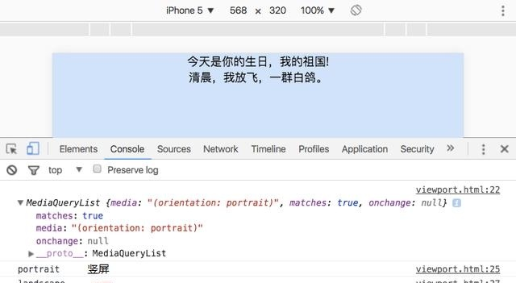

图片旋转90度的css代码：-webkit-transform: rotateZ(90deg);transform: rotateZ(90deg);

另外一种方法就是，检测手机屏幕是否是横屏了，css3@media{判断手机横竖屏}：

检测手机横屏代码：

```css
@media all and (orientation : landscape) {
.heng{height:100%;width:100%;text-align:center;background:#fff;position:absolute;z-index: 99999;display:block;}/*横屏时的样式*/

.heng p{margin:0 auto;color:#000;margin-top:90px;}

}
```


检测手机竖屏代码

```css
@media all and (orientation : portrait){
h2{color:green;}/*竖屏时样式*/
```

检测到手机旋转时

当然，css可以做到的，js也一样可以。我们可以通过访问对象的matches属性：

```js
if(mql.matches) {console.log('portrait'); // 竖屏}else {console.log('landscape'); // 横屏
```

监听屏幕方向变化，通过MediaQueryList对象的addListener方法；

```js
var mql = window.matchMedia('(orientation: portrait)');

console.log(mql);

function handleOrientationChange(mql) {
if(mql.matches) {
console.log('portrait'); // 打印竖屏

}else {
console.log('landscape'); // 打印横屏

// 打印日志

handleOrientationChange(mql);

// 监听屏幕模式的变化

mql.addListener(handleOrientationChange);
```

