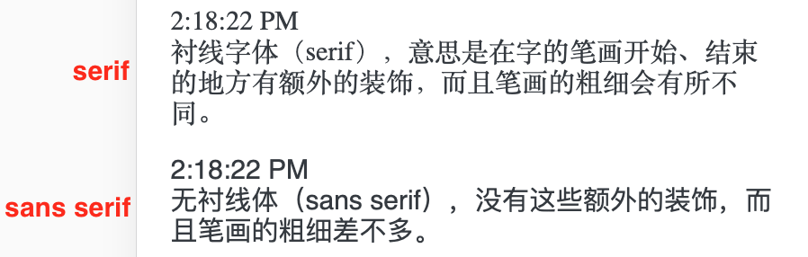
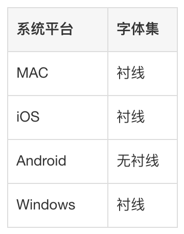
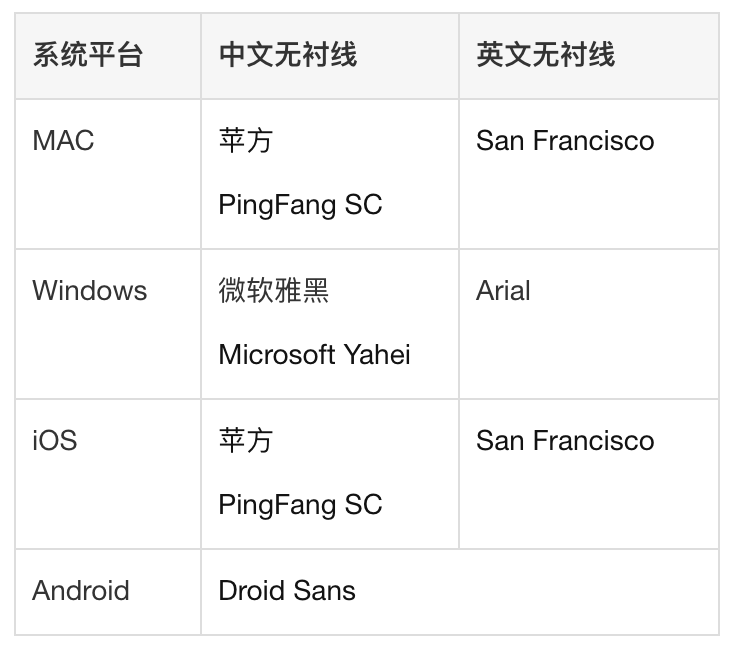

Web 页面的字体在开发（MAC）和以移动端为主的实际生产环境（iOS 和 Android）上的最佳默认字体设置为。

```css
body {
  font-family: "PingFang SC", "Hiragino Sans GB", "\5FAE\8F6F\96C5\9ED1", "Helvetica Neue", Helvetica, Arial, sans-serif;
}
```

### 衬线和无衬线

西方国家字母体系分为两类：衬线字体（serif）以及无衬线体（sans serif）。

衬线字体（serif）意思是在字的笔画开始、结束的地方有额外的装饰，而且笔画的粗细会有所不同。

无衬线体（sans serif）没有这些额外的装饰，而且笔画的粗细差不多。

在 CSS 中分别使用 serif 和 sans-serif 来设置衬线和无衬线字体，实际渲染效果如下图。



### 系统默认字体

Web 页面在不同平台不设置 CSS 的字体样式时使用的默认字体集是不一样的。



而不同系统使用的无衬线字体也是不一样的。



### 最佳字体设置说明

这里的“最佳”不是说“最好看”，应该是指优先使用系统默认字体和无衬线字体以达到最大限度的兼容，比如大部分界面都使用无衬线字体但是切换到你的 Web 页面就是衬线，这会显得很突兀。需要注意的是系统默认的无衬线字体并不代表就是 Web 页面默认的字体，所以需要显式的指定系统默认字体。

CSS 的 `font-family` 的设置规则是排在前面的优先级最高，会从前往后（从左往右）在字体设置中去查找系统默认的字体，当没有找到默认字体时就会往后查找，而当前面所有的都找不到时最后还是能找到字体集，所以下面的规则中 sans-serif 排在最后是非常有必要的。

```css
body {
  font-family: "PingFang SC", "Hiragino Sans GB", "\5FAE\8F6F\96C5\9ED1", "Helvetica Neue", Helvetica, Arial, sans-serif;
}
```

- PingFang SC（苹方） 是新版 MAC 和 iOS 都有的默认字体，也是页面设计师比较常用的字体，所有排在前面。
- Hiragino Sans GB （冬青黑体简体中文）是老版 MAC 和 iOS 的默认中文字体。
- \5FAE\8F6F\96C5\9ED1 （微软雅黑的 Unicode 编码表示法）是 Windows 的默认字体，这个字体是可选的，但是加上后如果用户在 Windows 电脑上打开了这个页面也会有比较好的显示效果。 Helvetica 和 Arial 太常见，不多做解释。

 