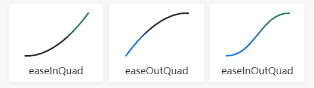

# [缓动函数 Easing Functions](https://www.cnblogs.com/ZTianming/p/15390536.html)

>缓动函数 自定义参数随时间变化的速率。

[**缓动函数**](https://easings.net/cn#)

## 常见效果

Linear：无缓动效果；
Quadratic：二次方的缓动（t^2）；
Sinusoidal：正弦曲线的缓动（sin(t)）；
Exponential：指数曲线的缓动（2^t）；
Circular：圆形曲线的缓动（sqrt(1-t^2)）；
Cubic：三次方的缓动（t^3）；
Quartic：四次方的缓动（t^4）；
Quintic：五次方的缓动（t^5）；
Elastic：指数衰减的正弦曲线缓动；
Back：超过范围的三次方缓动（(s+1)*t^3 - s*t^2）；
Bounce：指数衰减的反弹缓动。

### 缓动方式

每个效果都分三个缓动方式（方法），分别是：
easeIn：从0开始加速的缓动；
easeOut：减速到0的缓动；
easeInOut：前半段从0开始加速，后半段减速到0的缓动。


## 函数参数说明

每个函数包含 t、b、c 和 d 四个参数

- *t* = **Time** - 表示动画开始以来经过的时间。通常从0开始，通过游戏循环或update函数来缓慢增加。
- *b* = **Beginning value** - 动画的起点，默认从0开始。
- *c* = **Change in value** - 从起点到终点的差值。
- *d* = **Duration** - 完成动画所需的时间。

使用示例

t = 0 - 动画从0s开始
b = 200 - 对象 x 坐标的起始位置为200
c = 300 - 对象必须向右移动 300，到500 结束
d = 1 - 对象用 1 秒时间来完成从 200 到 500 的移动

## Linear 线性

```js
function easeLinear (t, b, c, d) {
    return c * t / d + b;
}
```

## Quadratic 二次渐变



Quadratic easing in

```js
function easeInQuad (t, b, c, d) {
    return c * (t /= d) * t + b;
}
```

Quadratic easing out

```js
function easeOutQuad (t, b, c, d) {
    return -c * (t /= d) * (t - 2) + b;
}
```

Quadratic easing in and out

```js
function easeInOutQuad (t, b, c, d) {
    if ((t /= d / 2) < 1) return c / 2 * t * t + b;
    return -c / 2 * ((--t) * (t - 2) - 1) + b;
}
```

## Sinusoidal 正弦渐变


Sinusoidal easing in

```js
function easeInSine (t, b, c, d) {
    return -c * Math.cos(t / d * (Math.PI / 2)) + c + b;
}
```

Sinusoidal easing out

```js
function easeOutSine (t, b, c, d) {
    return c * Math.sin(t / d * (Math.PI / 2)) + b;
}
```

Sinusoidal easing in and out

```js
function easeInOutSine (t, b, c, d) {
    return -c / 2 * (Math.cos(Math.PI * t / d) - 1) + b;
}
```

## Exponential 指数渐变


Exponential easing in

```js
function easeInExpo (t, b, c, d) {
    return (t == 0) ? b : c * Math.pow(2, 10 * (t / d - 1)) + b;
}
```

Exponential easing out

```js
function easeOutExpo (t, b, c, d) {
    return (t == d) ? b + c : c * (-Math.pow(2, -10 * t / d) + 1) + b;
}
```

Exponential easing in and out

```js
function easeInOutExpo (t, b, c, d) {
    if (t == 0) return b;
    if (t == d) return b + c;
    if ((t /= d / 2) < 1) return c / 2 * Math.pow(2, 10 * (t - 1)) + b;
    return c / 2 * (-Math.pow(2, -10 * --t) + 2) + b;
}
```

## Circular 圆形曲线


Circular easing in

```js
function easeInCirc (t, b, c, d) {
    return -c * (Math.sqrt(1 - (t /= d) * t) - 1) + b;
}
```

Circular easing out

```js
function easeOutCirc (t, b, c, d) {
    return c * Math.sqrt(1 - (t = t / d - 1) * t) + b;
}
```

Circular easing in and out

```js
function easeInOutCirc (t, b, c, d) {
    if ((t /= d / 2) < 1) return -c / 2 * (Math.sqrt(1 - t * t) - 1) + b;
    return c / 2 * (Math.sqrt(1 - (t -= 2) * t) + 1) + b;
}
```

## Cubic 三次方


Cubic easing in

```js
function easeInCubic (t, b, c, d) {
    return c * (t /= d) * t * t + b;
}
```

Cubic easing out

```js
function easeOutCubic (t, b, c, d) {
    return c * ((t = t / d - 1) * t * t + 1) + b;
}
```

Cubic easing in and out

```js
function easeInOutCubic (t, b, c, d) {
    if ((t /= d / 2) < 1) return c / 2 * t * t * t + b;
    return c / 2 * ((t -= 2) * t * t + 2) + b;
}
```

## Quartic 四次方


Quartic easing in

```js
function easeInQuart (t, b, c, d) {
    return c * (t /= d) * t * t * t + b;
}
```

Quartic easing out

```js
function easeOutQuart (t, b, c, d) {
    return -c * ((t = t / d - 1) * t * t * t - 1) + b;
}
```

Quartic easing in and out

```js
function easeInOutQuart (t, b, c, d) {
    if ((t /= d / 2) < 1) return c / 2 * t * t * t * t + b;
    return -c / 2 * ((t -= 2) * t * t * t - 2) + b;
}
```

## Quintic 五次方


Quintic easing in

```js
function easeInQuint (t, b, c, d) {
    return c * (t /= d) * t * t * t * t + b;
}
```

Quintic easing out

```js
function easeOutQuint (t, b, c, d) {
    return c * ((t = t / d - 1) * t * t * t * t + 1) + b;
}
```

Quintic easing in and out

```js
function easeInOutQuint (t, b, c, d) {
    if ((t /= d / 2) < 1) return c / 2 * t * t * t * t * t + b;
    return c / 2 * ((t -= 2) * t * t * t * t + 2) + b;
}
```

## Elastic 指数衰减正弦曲线


Elastic easing in

```js
function easeInElastic (t, b, c, d) {
    var s = 1.70158;
    var p = 0;
    var a = c;
    if (t == 0) return b;
    if ((t /= d) == 1) return b + c;
    if (!p) p = d * .3;
    if (a < Math.abs(c)) {
        a = c;
        var s = p / 4;
    }
    else var s = p / (2 * Math.PI) * Math.asin(c / a);
    return -(a * Math.pow(2, 10 * (t -= 1)) * Math.sin((t * d - s) * (2 * Math.PI) / p)) + b;
}
```

Elastic easing out

```js
function easeOutElastic (t, b, c, d) {
    var s = 1.70158;
    var p = 0;
    var a = c;
    if (t == 0) return b;
    if ((t /= d) == 1) return b + c;
    if (!p) p = d * .3;
    if (a < Math.abs(c)) {
        a = c;
        var s = p / 4;
    }
    else var s = p / (2 * Math.PI) * Math.asin(c / a);
    return a * Math.pow(2, -10 * t) * Math.sin((t * d - s) * (2 * Math.PI) / p) + c + b;
}
```

Elastic easing in and out

```js
function easeInOutElastic (t, b, c, d) {
    var s = 1.70158;
    var p = 0;
    var a = c;
    if (t == 0) return b;
    if ((t /= d / 2) == 2) return b + c;
    if (!p) p = d * (.3 * 1.5);
    if (a < Math.abs(c)) {
        a = c;
        var s = p / 4;
    }
    else var s = p / (2 * Math.PI) * Math.asin(c / a);
    if (t < 1) return -.5 * (a * Math.pow(2, 10 * (t -= 1)) * Math.sin((t * d - s) * (2 * Math.PI) / p)) + b;
    return a * Math.pow(2, -10 * (t -= 1)) * Math.sin((t * d - s) * (2 * Math.PI) / p) * .5 + c + b;
}
```

## Back


Back easing in

```js
function easeInBack (t, b, c, d) {
    if (s == undefined) s = 1.70158;
    return c * (t /= d) * t * ((s + 1) * t - s) + b;
}
```

Back easing out

```js
function easeOutBack (t, b, c, d) {
    if (s == undefined) s = 1.70158;
    return c * ((t = t / d - 1) * t * ((s + 1) * t + s) + 1) + b;
}
```

Back easing in and out

```js
function easeInOutBack (t, b, c, d) {
    if (s == undefined) s = 1.70158;
    if ((t /= d / 2) < 1) return c / 2 * (t * t * (((s *= (1.525)) + 1) * t - s)) + b;
    return c / 2 * ((t -= 2) * t * (((s *= (1.525)) + 1) * t + s) + 2) + b;
}
```

## Bounce


Bounce easing in

```js
function easeInBounce(t, b, c, d) {
   return c - easeOutBounce(d - t, 0, c, d) + b;
}
```

Bounce easing out

```js
function easeOutBounce(t, b, c, d) {
    if ((t/=d) < (1/2.75)) {
      return c*(7.5625*t*t) + b;
    } else if (t < (2/2.75)) {
      return c*(7.5625*(t-=(1.5/2.75))*t + .75) + b;
    } else if (t < (2.5/2.75)) {
      return c*(7.5625*(t-=(2.25/2.75))*t + .9375) + b;
    } else {
      return c*(7.5625*(t-=(2.625/2.75))*t + .984375) + b;
    }
  }
```

Bounce easing in and out

```js
function easeInOutBounce(t, b, c, d) {
    if (t < d/2) return easeInBounce (t*2, 0, c, d) * .5 + b;
    return easeOutBounce (t*2-d, 0, c, d) * .5 + c*.5 + b;
  }
```

