# [css选择器 last-child & last-of-type](https://segmentfault.com/a/1190000020109948)

>last-child【同理first-child】
:last-child表示其父元素的最后一个子元素，且这个元素是css指定的元素，才可以生效。

> last-of-type【同理first-of-type】
> :last-of-type表示其父元素的最后一个指定类型的元素

这两个区别就是last-child必须要多具备一个条件，就是必须是父元素的最后一个子元素，强调的是最后child，而last-of-type只要符合最后一个type就可以。【例子1 2 】

弊端：对于元素选择伪类比较准确，但是对于类选择器选择伪类可能就会不太准确【例子 3 4】

### 一、正常情况的没有干扰元素的ul下面全部都是li

html
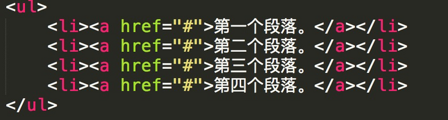
css

结果： 两个都会对最后一个li生效。

last-child
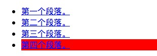

last-of-type
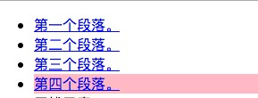

### 二、ul下面不止有li，还有其他的元素，这个在实际场景中也是会出现的

html
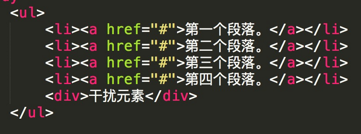
css

结果： last-child选不中目标元素，last-of-type可以选择目标元素

last-child
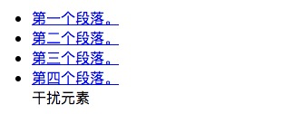

last-of-type
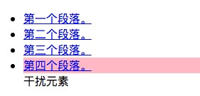

### 三、选择某类的最后一项

html
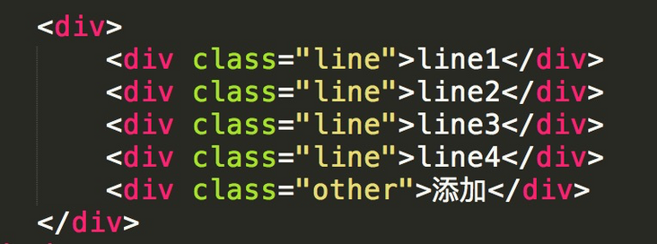
css
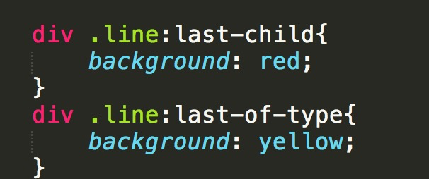

结果： last-child与last-of-type均不会选中某类的最后一项

.line:last-child与.line:last-of-type

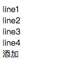

### 四、父元素下同类名不同元素选择最后一个类名

html
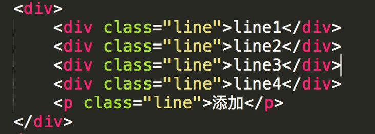

css
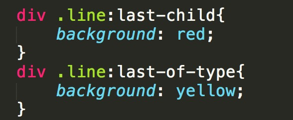

结果：last-child选中既是最后一个子元素又是最后一个类名元素； last-of-type 会选择不同元素的最后一项子类

.line:last-child
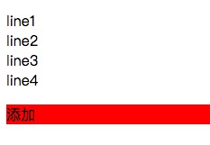

.line:last-of-type
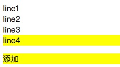