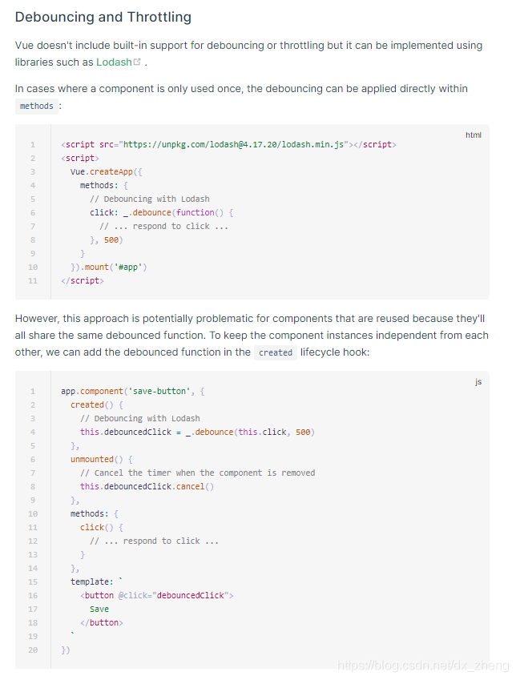

# vue中使用 lodash Debounce防抖不生效原因

```js
methods:{
	change:
	    debounce(()=>{
	      console.log(1111);
	      //todo
	    }, 500),
	//下面这种方式是不可行的，debounce返回了一个函数
	changes(){
      debounce(function(){
        console.log(1111)
      }, 500)      
    },
 }
```

这里要特别注意函数change的写法，必须这种change: 的写法，如果要使用change()要使用调用的方式，但最终有调用debounce的函数还是要另一种写法。

```js
methods: {  
      // 加载到原型链上的lodash，在getRemote后取不到
    // 注意，这里debounce中的第一个参数，不能写成箭头函数，否则，取不到this
   getRemote: _.debounce(function () {
     console.log(111)
   }, 1000),
   search () {
     this.getRemote()
   }
 }
```



## 防抖函数所遇见的坑

# Vue中写法使用

`注意`: Vue中使用时，需要`定义`timeout，同时在防抖函数中，this的指向发生了变化，需要`在return之前获取vue实例`。这个时候，你直接使用，还是不行的，只要debug就会发现debounce返回的func没有进去，需要`手动执行`一下`(添加括号)`。

```javascript
  data() {
    return {
      timeout: null
    }
  }
12345
    change(volume, data) {
      this.debounce(() => {
        console.log('change', volume, data)
      }, 500)
    },
    debounce(func, delay) {
      let context = this // this指向发生变化，需要提出来
      let args = arguments
      return function () {
        if (context.timeout) {
          clearTimeout(context.timeout)
        }
        context.timeout = setTimeout(() => {
          func.apply(context, args)
        }, delay)
      }()// 注意:我加了()
    }
1234567891011121314151617
```

# Vue中的watch的防抖简写

```javascript
    watchObj: {
      handler(val) {
        let _this = this
        clearTimeout(this.timeout)
        this.timeout = setTimeout(() => {
          _this.handlerData(val)
        }, 500)
      }
    }
```

### _.throttle和_.debounce的区别：

> 虽然在等待时间内函数都不会再执行，但_.throttle在**第一次**触发后开始计算等待时间，_.debounce在**最后一次**触发之后才计算等待时间（最后一次在等待时间范围内）。

_.throttle和_.debounce的返回值是一个函数，运行这个函数才相当于运行包装了setTimeout的函数体，
