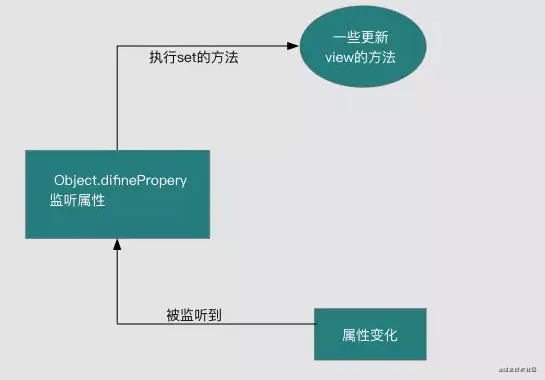

# 1. 说一说vue的双向绑定原理

答：vue.js 则是采用数据劫持结合发布者-订阅者模式的方式，通过 Object.defineProperty() 来劫持各个属性的setter，getter，在数据变动时发布消息给订阅者，触发相应的监听回调。

> 具体流程



1.实现一个监听器Observer，用来劫持并监听所有属性，如果有变动的，就通知订阅者。

2.实现一个订阅者Watcher，可以收到属性的变化通知并执行相应的函数，从而更新视图。

3.实现一个解析器Compile，可以扫描和解析每个节点的相关指令，并根据初始化模板数据以及初始化相应的订阅器

# 2.vue3的双向绑定和vue2的区别

答：vue3的双向绑定不同的是不再通过Object.defineProperty()来给属性添加，而是通过Proxy给添加了一层代理器

不同之处：

```Object.defineProperty()和Proxy对比
1.Proxy是对整个对象的代理，而Object.defineProperty只能代理某个属性。
2.对象上新增属性，Proxy可以监听到，Object.defineProperty不能。
3.数组新增修改，Proxy可以监听到，Object.defineProperty不能。
4.若对象内部属性要全部递归代理，Proxy可以只在调用的时候递归，而Object.definePropery需要一次完成所有递归，性能比Proxy差。
5.Proxy在ie浏览器上存在兼容问题
```


作者：没光的奥特曼
链接：https://juejin.cn/post/6978800849157898248
来源：掘金
著作权归作者所有。商业转载请联系作者获得授权，非商业转载请注明出处。

