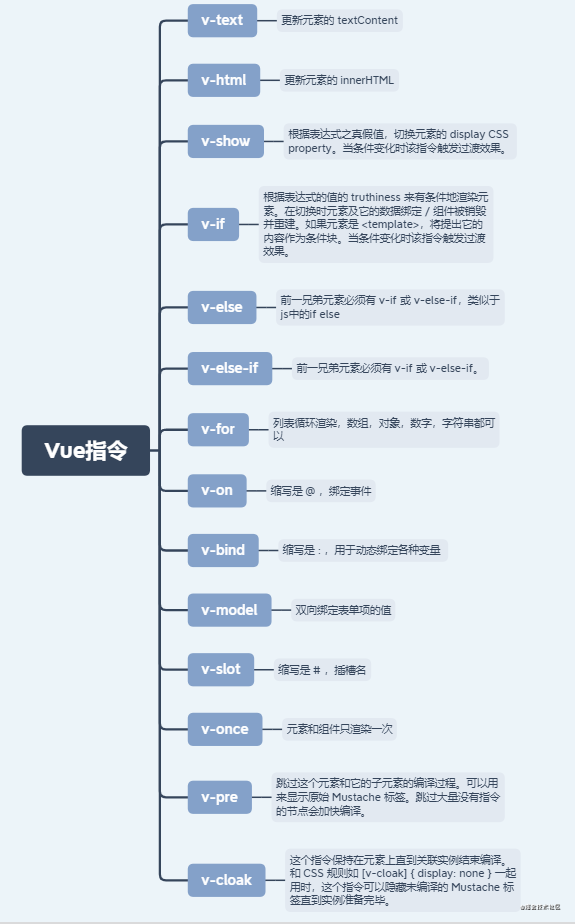
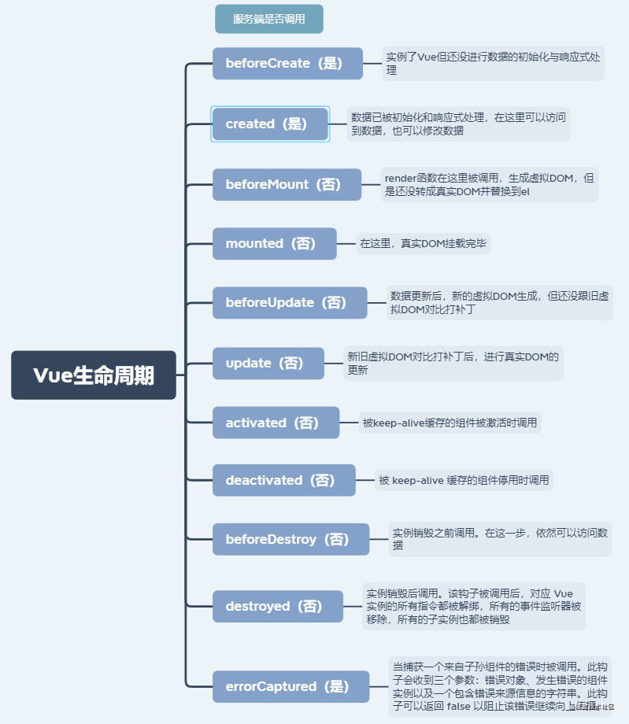

### 为什么data是个函数并且返回一个对象呢？

`data`之所以只一个函数，是因为一个组件可能会多处调用，而每一次调用就会执行`data函数`并返回新的数据对象，这样，可以避免多处调用之间的`数据污染`。

### 使用过哪些Vue的内部指令呢？

 

### 组件之间的传值方式有哪些？

- 父组件传值给子组件，子组件使用`props`进行接收
- 子组件传值给父组件，子组件使用`$emit+事件`对父组件进行传值
- 组件中可以使用`$parent`和`$children`获取到父组件实例和子组件实例，进而获取数据
- 使用`$attrs`和`$listeners`，在对一些组件进行二次封装时可以方便传值，例如A->B->C
- 使用`$refs`获取组件实例，进而获取数据
- 使用`Vuex`进行状态管理
- 使用`eventBus`进行跨组件触发事件，进而传递数据
- 使用`provide`和`inject`，官方建议我们不要用这个，我在看`ElementUI`源码时发现大量使用
- 使用浏览器本地缓存，例如`localStorage`

### 如何设置动态class，动态style？

- 动态class对象：`<div :class="{ 'is-active': true, 'red': isRed }"></div>`
- 动态class数组：`<div :class="['is-active', isRed ? 'red' : '' ]"></div>`
- 动态style对象：`<div :style="{ color: textColor, fontSize: '18px' }"></div>`
- 动态style数组：`<div :style="[{ color: textColor, fontSize: '18px' }, { fontWeight: '300' }]"></div>`

### computed和watch有何区别？

- 1.`computed`是依赖已有的变量来计算一个目标变量，大多数情况都是`多个变量`凑在一起计算出`一个变量`，并且`computed`具有`缓存机制`，依赖值不变的情况下其会直接读取缓存进行复用，`computed`不能进行`异步操作`
- 2.`watch`是监听某一个变量的变化，并执行相应的回调函数，通常是`一个变量`的变化决定`多个变量`的变化，`watch`可以进行`异步操作`
- 3.简单记就是：一般情况下`computed`是`多对一`，`watch`是`一对多`

 

### 为什么v-if和v-for不建议用在同一标签？

在Vue2中，`v-for`优先级是高于`v-if`的

### 不需要响应式的数据应该怎么处理？

```js
// 方法一：将数据定义在data之外
data () {
    this.list1 = { xxxxxxxxxxxxxxxxxxxxxxxxxxxxxxx }
    this.list2 = { xxxxxxxxxxxxxxxxxxxxxxxxxxxxxxx }
    this.list3 = { xxxxxxxxxxxxxxxxxxxxxxxxxxxxxxx }
    this.list4 = { xxxxxxxxxxxxxxxxxxxxxxxxxxxxxxx }
    this.list5 = { xxxxxxxxxxxxxxxxxxxxxxxxxxxxxxx }
    return {}
 }
    
// 方法二：Object.freeze()
data () {
    return {
        list1: Object.freeze({xxxxxxxxxxxxxxxxxxxxxxxx}),
        list2: Object.freeze({xxxxxxxxxxxxxxxxxxxxxxxx}),
        list3: Object.freeze({xxxxxxxxxxxxxxxxxxxxxxxx}),
        list4: Object.freeze({xxxxxxxxxxxxxxxxxxxxxxxx}),
        list5: Object.freeze({xxxxxxxxxxxxxxxxxxxxxxxx}),
    }
 }

```

### watch有哪些属性，分别有什么用？

```js
watch: {
    obj: {
       handler () { // 执行回调
           // do something
       },
       deep: true, // 是否进行深度监听
       immediate: true // 是否初始执行handler函数
    }
}
```

### 父子组件生命周期顺序

父beforeCreate -> 父created -> 父beforeMount -> 子beforeCreate -> 子created -> 子beforeMount -> 子mounted -> 父mounted

### 对象新属性无法更新视图，删除属性无法更新视图，为什么？怎么办？

- 原因：`Object.defineProperty`没有对对象的新属性进行属性劫持
- 对象新属性无法更新视图：使用`Vue.$set(obj, key, value)`，组件中`this.$set(obj, key, value)`
- 删除属性无法更新视图：使用`Vue.$delete(obj, key)`，组件中`this.$delete(obj, key)`

### 为什么不建议用index做key，为什么不建议用随机数做key？

用`index`和用`随机数`都是同理，`随机数`每次都在变，做不到专一性，很`渣男`，也很消耗性能

### 说说nextTick的用处？

我们修改了三个变量，那问题来了，是每修改一次，DOM就更新一次吗？不是的，Vue采用的是`异步更新`的策略，通俗点说就是，`同一事件循环内`多次修改，会`统一`进行一次`视图更新`，这样才能节省性能嘛

Vue是`异步更新`，所以数据一更新，视图却还没更新，所以拿到的还是上一次的旧视图数据，那么想要拿到最新视图数据怎么办呢？

```js
this.name = '林三心'
this.$nextTick(() => {
    console.log(this.$refs.testDiv.innerHTML) // 林三心
})
```

### Vue响应式是怎么实现的？

整体思路是数据劫持+观察者模式

对象内部通过` defineReactive` 方法，使用 `Object.defineProperty` 将属性进行劫持（只会劫持已经存在的属性），数组则是通过重写数组方法来实现。当页面使用对应属性时，每个属性都拥有自己的`dep`属性，存放他所依赖的` watcher`（依赖收集），当属性变化后会通知自己对应的` watcher` 去更新(派发更新)。

### nextTick的原理？

```js
let callbacks = []; //回调函数
let pending = false;
function flushCallbacks() {
  pending = false; //把标志还原为false
  // 依次执行回调
  for (let i = 0; i < callbacks.length; i++) {
    callbacks[i]();
  }
}
let timerFunc; //先采用微任务并按照优先级优雅降级的方式实现异步刷新
if (typeof Promise !== "undefined") {
  // 如果支持promise
  const p = Promise.resolve();
  timerFunc = () => {
    p.then(flushCallbacks);
  };
} else if (typeof MutationObserver !== "undefined") {
  // MutationObserver 主要是监听dom变化 也是一个异步方法
  let counter = 1;
  const observer = new MutationObserver(flushCallbacks);
  const textNode = document.createTextNode(String(counter));
  observer.observe(textNode, {
    characterData: true,
  });
  timerFunc = () => {
    counter = (counter + 1) % 2;
    textNode.data = String(counter);
  };
} else if (typeof setImmediate !== "undefined") {
  // 如果前面都不支持 判断setImmediate
  timerFunc = () => {
    setImmediate(flushCallbacks);
  };
} else {
  // 最后降级采用setTimeout
  timerFunc = () => {
    setTimeout(flushCallbacks, 0);
  };
}

export function nextTick(cb) {
  callbacks.push(cb);
  if (!pending) {
    pending = true;
    timerFunc();
  }
}
```

###  props怎么自定义验证

```js
props: {
    num: {
      default: 1,
      validator: function (value) {
          // 返回值为true则验证不通过，报错
          return [
            1, 2, 3, 4, 5
          ].indexOf(value) !== -1
    }
    }
  }
```

### watch监听一个对象时，如何排除某些属性的监听

> 但是如果我只想要a，b改变时重新请求，c，d改变时不重新请求呢？

```js
mounted() {
    Object.keys(this.params)
      .filter((_) => !["c", "d"].includes(_)) // 排除对c，d属性的监听
      .forEach((_) => {
        this.$watch((vm) => vm.params[_], handler, {
          deep: true,
        });
      });
  },
data() {
    return {
      params: {
        a: 1,
        b: 2,
        c: 3,
        d: 4
      },
    };
  },
watch: {
    params: {
      deep: true,
      handler() {
        this.getList;
      },
    },
  }
```

### computed如何实现传参？

```js
// html
<div>{{ total(3) }}

// js
computed: {
    total() {
      return function(n) {
          return n * this.num
         }
    },
  }
```


作者：Sunshine_Lin
链接：https://juejin.cn/post/6984210440276410399
来源：掘金
著作权归作者所有。商业转载请联系作者获得授权，非商业转载请注明出处。