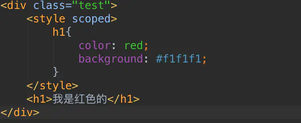

[**伪类与伪元素**](http://www.alloyteam.com/2016/05/summary-of-pseudo-classes-and-pseudo-elements/)

**CSS的盒子模型**

**常见的兼容性问题？**

1. 不同浏览器的标签默认的margin和padding不一样。

   *{margin:0;padding:0;}

2. IE6双边距bug：块属性标签float后，又有横行的margin情况下，在IE6显示margin比设置的大。hack：display:inline;将其转化为行内属性。

3. 渐进识别的方式，从总体中逐渐排除局部。首先，巧妙的使用“9”这一标记，将IE浏览器从所有情况中分离出来。接着，再次使用“+”将IE8和IE7、IE6分离开来，这样IE8已经独立识别。

   ```
   {
   background-color:#f1ee18;/*所有识别*/
   .background-color:#00deff\9; /*IE6、7、8识别*/
   +background-color:#a200ff;/*IE6、7识别*/
   _background-color:#1e0bd1;/*IE6识别*/
   }
   ```

4. 设置较小高度标签（一般小于10px），在IE6，IE7中高度超出自己设置高度。hack：给超出高度的标签设置overflow:hidden;或者设置行高line-height 小于你设置的高度。

5. IE下，可以使用获取常规属性的方法来获取自定义属性,也可以使用getAttribute()获取自定义属性；Firefox下，只能使用getAttribute()获取自定义属性。解决方法:统一通过getAttribute()获取自定义属性。

6. Chrome 中文界面下默认会将小于 12px 的文本强制按照 12px 显示,可通过加入 CSS 属性 -webkit-text-size-adjust: none; 解决。

7. 超链接访问过后hover样式就不出现了，被点击访问过的超链接样式不再具有hover和active了。解决方法是改变CSS属性的排列顺序:L-V-H-A ( love hate ): a:link {} a:visited {} a:hover {} a:active {}

**初始化CSS样式**

**对BFC规范(块级格式化上下文：block formatting context)的理解？**

BFC规定了内部的Block Box如何布局。
定位方案：

1. 内部的Box会在垂直方向上一个接一个放置。
2. Box垂直方向的距离由margin决定，属于同一个BFC的两个相邻Box的margin会发生重叠。
3. 每个元素的margin box 的左边，与包含块border box的左边相接触。
4. BFC的区域不会与float box重叠。
5. BFC是页面上的一个隔离的独立容器，容器里面的子元素不会影响到外面的元素。
6. 计算BFC的高度时，浮动元素也会参与计算。

满足下列条件之一就可触发BFC

1. 根元素，即html
2. float的值不为none（默认）
3. overflow的值不为visible（默认）
4. display的值为inline-block、table-cell、table-caption
5. position的值为absolute或fixed

**设置元素浮动后，该元素的display值是多少？**

自动变成display:block

**CSS优化、提高性能的方法有哪些？**

1. 避免过度约束
2. 避免后代选择符
3. 避免链式选择符
4. 使用紧凑的语法
5. 避免不必要的命名空间
6. 避免不必要的重复
7. 最好使用表示语义的名字。一个好的类名应该是描述他是什么而不是像什么
8. 避免！important，可以选择其他选择器
9. 尽可能的精简规则，你可以合并不同类里的重复规则

**在网页中的应该使用奇数还是偶数的字体？为什么呢？**

使用偶数字体。偶数字号相对更容易和 web 设计的其他部分构成比例关系。Windows 自带的点阵宋体（中易宋体）从 Vista 开始只提供 12、14、16 px 这三个大小的点阵，而 13、15、17 px时用的是小一号的点。（即每个字占的空间大了 1 px，但点阵没变），于是略显稀疏。

**如果需要手动写动画，你认为最小时间间隔是多久，为什么？**
多数显示器默认频率是60Hz，即1秒刷新60次，所以理论上最小间隔为1/60＊1000ms ＝ 16.7ms。

**li与li之间有看不见的空白间隔是什么原因引起的？有什么解决办法？**

行框的排列会受到中间空白（回车空格）等的影响，因为空格也属于字符,这些空白也会被应用样式，占据空间，所以会有间隔，把字符大小设为0，就没有空格了。
解决方法：

1. 可以将<li>代码全部写在一排
2. 浮动li中float：left
3. 在ul中用font-size：0（谷歌不支持）；可以使用letter-space：-3px

**style标签写在body后与body前有什么区别？**

页面加载自上而下 当然是先加载样式。
写在body标签后由于浏览器以逐行方式对HTML文档进行解析，当解析到写在尾部的样式表（外联或写在style标签）会导致浏览器停止之前的渲染，等待加载且解析样式表完成之后重新渲染，在windows的IE下可能会出现FOUC现象（即样式失效导致的页面闪烁问题）

### **style加入此属性后，这些属性只会在当前包裹它的元素及其子元素内生效**，

