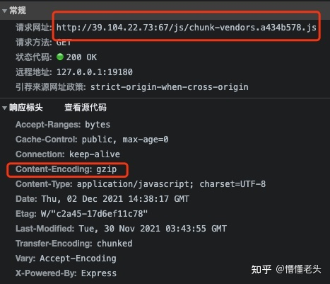

# [vue首屏性能优化，解决页面加载时间过长（白屏）方法](https://blog.csdn.net/weixin_43915587/article/details/93165250?utm_medium=distribute.pc_relevant.none-task-blog-2%7Edefault%7EBlogCommendFromMachineLearnPai2%7Edefault-1.control&depth_1-utm_source=distribute.pc_relevant.none-task-blog-2%7Edefault%7EBlogCommendFromMachineLearnPai2%7Edefault-1.control)

vuecli 2.x自带了分析工具，只要运行 `npm run build --report`

如果是 vuecli 3的话，先安装插件

```
cnpm intall webpack-bundle-analyzer -–save-dev
```

然后新建vue.config.js，对 webpack进行配置：

```
chainWebpack: (config) => {
    /* 添加分析工具*/
    if (process.env.NODE_ENV === 'production') {
        if (process.env.npm_config_report) {
            config
                .plugin('webpack-bundle-analyzer')
                .use(require('webpack-bundle-analyzer').BundleAnalyzerPlugin)
                .end();
            config.plugins.delete('prefetch')
        }
    } }
```

再运行 `npm run build --report`

## 优化策略：

## **1、路由懒加载**

在 router.js文件中，原来的静态引用方式，如：

```
import ShowBlogs from '@/components/ShowBlogs'

routes:[ path: 'Blogs', name: 'ShowBlogs', component: ShowBlogs ]
```

改为：

```
 routes:[ 
 		path: 'Blogs',
 		name: 'ShowBlogs',
 		component: () => import('./components/ShowBlogs.vue')
 	]
12345
```

如果是在 vuecli 3中，我们还需要多做一步工作
因为 vuecli 3默认开启 **prefetch(预先加载模块)**，提前获取用户未来可能会访问的内容
在首屏会把这十几个路由文件，都一口气下载了
所以我们要关闭这个功能，在 vue.config.js中设置:


## ui框架按需加载

在 .babelrc / babel.config.js文件中添加（ **vue-cli 3要先安装 babel-plugin-component**)：

```
plugins: [
    [
      "component",
      {
        "libraryName": "element-ui",
        "styleLibraryName": "theme-chalk"
      }
    ]
  ]
```

## gzip压缩

安装 compression-webpack-plugin

```
cnpm i compression-webpack-plugin -D
```

在 vue.congig.js中引入并修改 webpack配置:

```
const CompressionPlugin = require('compression-webpack-plugin')

configureWebpack: (config) => {
        if (process.env.NODE_ENV === 'production') {
            // 为生产环境修改配置...
            config.mode = 'production'
            return {
                plugins: [new CompressionPlugin({
                    test: /\.js$|\.html$|\.css/, //匹配文件名
                    threshold: 10240, //对超过10k的数据进行压缩
                    deleteOriginalAssets: false //是否删除原文件
                })]
            }
        }
```

在服务器我们也要做相应的配置
如果发送请求的浏览器支持 gzip，就发送给它 gzip格式的文件
我的服务器是用 express框架搭建的
只要安装一下 compression就能使用

```
const compression = require('compression')
app.use(compression())
```

### vue.config.js配置如下

```js
module.exports = {
  configureWebpack:config=>{
    // GZip压缩
    const CompressionPlugin = require('compression-webpack-plugin');
    config.plugins.push(
      new CompressionPlugin({
        algorithm:'gzip',
        test:/\.(js|css|woff|woff2|svg)$/,  // 要压缩的文件
        threshold:10240, // 压缩超过10k的数据
        deleteOriginalAssets:false, // 不删除压缩前的文件，如果浏览器不支持Gzip，则会加载源文件
        minRatio:0.8 // 压缩比大于0.8的文件将不会被压缩
      })
    );
  }
};
```

### 4、服务器配置

压缩好了，但是服务器还是下载.js文件，而不下载.gz文件。还是以前一样的大小，首屏加载还是那么慢。去网上查到了如下解释

- gz文件是在网络传输时候减小网络开销用的，在服务器配置开启gzip，请求会优先匹配同文件名的gz压缩格式返回，浏览器拿到之后会自动解压，你引用的是解压后的js或css文件
- nginx 会优先匹配你的 gzip 文件来返回，如果没有就寻找相应资源进行 gzip 压缩再返回。

于是开始准备给服务器软件开启Gzip支持，但是我的服务是原生node直接起的，没法支持Gzip。查到express/ngix/apache都支持GZip功能，于是我用express框架重写了服务，并且使用了compression组件来支持GZip功能。也很便利，大概如下：

```js
var express = require('express');
var compression = require('compression');   // 引入compresssion

var app = express();
app.use(compression());                     // 使用compression

http.createServer(app).listen(67);

app.get('/', (req, res) => {
  res.sendFile('index.html', {root: __dirname});
});
```

 